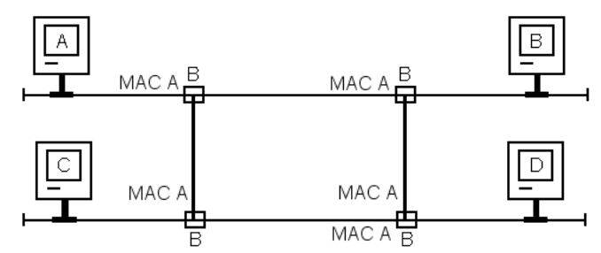

# Netzwerktechnik 2AHIT - 3AHIT 2023 - 2025

## Netzwerkadressierung

### Adresskonzept IPV4

IPV4 -> 4Byte, jedes Byte 8bit

00000000.00000000.00000000.00000000 zu 11111111.11111111.11111111.11111111

In Dezimal dargestellt: 0.0.0.0 zu 255.255.255.255

Adressklassen A-E, A ist größte, C ist kleinste netzwerk, DEF ist reserviert

### Adressbereiche

| Klasse | Adressbereich               | Netze       | Adressen |
| ------ | --------------------------- | ----------- | -------- |
| A      | 0.0.0.0 - 127.255.255.255   | 128 (0-127) | 16777216 |
| B      | 128.0.0.0 - 191.255.255.255 | 16384       | 65536    |
| C      | 192.0.0.0 - 223.255.255.255 | 2097152     | 256      |

Vergabe der IP adressen im öffentlichen bereich macht die IANA

| Klasse | Adressbereich               | multicast adresses |
| ------ | --------------------------- | ------------------ |
| D      | 224.0.0.0 - 224.0.0.255     | well-known         |
| E      | 224.0.1.0 - 238.255.255.255 | globally-scoped    |
| F      | 239.0.0.0 - 239.255.255.255 | local              |

Private Adressbereiche

| Klasse | Adressbereich                 | Netze | Adressen |
| ------ | ----------------------------- | ----- | -------- |
| A      | 10.0.0.0 - 10.255.255.255     | 1     | 16581375 |
| B      | 172.16.0.0 - 172.31.255.255   | 15    | 65025    |
| C      | 192.168.0.0 - 192.168.255.255 | 256   | 256      |

### Netzmaske

Die Netzmaske teilt das netwerk in Host und Netzwerkanteil

| Klasse | Maske         |
| ------ | ------------- |
| A      | 255.0.0.0     |
| B      | 255.255.0.0   |
| C      | 255.255.255.0 |

CIDR Schreibweise ist die Anzahl von 1ern an die Netzwerkadresse geschrieben (eg: 192.168.1.0/24)

IP-Adresse und Subnetzmaske werden in Binär logisch addiert und resultierend ist wo Host und wo Netzteil ist.

|            | 192.168.0.21/24                   |          |          |          |
| ---------- | --------------------------------- | -------- | -------- | -------- |
| IP Adresse | 11000000                          | 10101000 | 00000000 | 00010101 |
| Netzmaske  | 11111111                          | 11111111 | 11111111 | 00000000 |
| 1+1=1      | 11000000                          | 10101000 | 00000000 |          |
| Netzwerk   | 192                               | 168      | 0        | 0        |
| Hosts      | $2⁸$ = 256 &rarr; (0..255) 1..254 |          |          |          |

BSPB:

| Klasse C:    | 192.12.50.0/24  |
| ------------ | --------------- |
| Netzmaske:   | 255.255.255.0   |
| Netzadresse: | 192.12.50.0     |
| Gateway:     | 192.12.50.1     |
| IP-Adressen: | 192.12.50.2-254 |
| BC-Adresse:  | 192.12.50.255   |

1. Teilnetz
   
   | Netzwerkadresse: | 192.12.50.0     |
   | ---------------- | --------------- |
   | Subnetzmaske:    | 255.255.255.128 |
   | Gateway:         | 192.12.50.1     |
   | IP-Adressen:     | 192.12.50.2-126 |
   | BC-Adresse:      | 192.12.50.127   |

2. Teilnetz

| Netzwerkadresse: | 192.12.50.128     |
| ---------------- | ----------------- |
| Subnetzmaske:    | 255.255.255.128   |
| Gateway:         | 192.12.50.129     |
| IP-Adressen:     | 192.12.50.130-254 |
| BC-Adresse:      | 192.12.50.255     |

- Netzwerkadresse:    192.12.50.128
  Subnetzmaske:    255.255.255.128
  Gateway:    192.12.50.129
  IP-Adressen:    192.12.50.130-254
  BC-Adresse:    192.12.50.255Subnetze verrringert die Anzahl von zuordnungsfähigen Hostadressen (-3 Adressen)

- Alle Rechner eines Netzwerksegmentes müssen dessen Subnetzmaske verwenden

- Übergeordnete Netze sehen diese Adressen als ganz normale IP-Adressen

### Link-Local (Autoconfiguration)

Selbstständige konfiguration von Clients im einem Netzwerk ohne DHCP server, statischer Configuration oä.

| IP bereich: | 169.254.0.0 - 169.254.255.255 |
| ----------- | ----------------------------- |
| Netzmaske:  | /16                           |

## Netzwerkprotokolle ARP/DHCP/Ping

### ARP → Adress Resolution Protocol → Layer 2 (OSI)

- Übersetzt IP-Adressen in Hardwareadressen

- Hardwareadresse des Ziels muss bekannt sein

- Feste Hardwareadresse; Mac adresse

###### Um zu senden ist eine Adress auflösung erforderlich:

Absender sendet ARP-Request mit (Ziel)Adresse FF-FF-FF-FF-FF-FF an alle (in der Broadcast domain, abgeschrenkt durch Bridge bzw Router), jeder nimmt diese request entgegen und wertet sie aus (Schaut sich die IP Adresse im Ethernet frame an), sollte dieser Host gemeint sein (identische IP) schickt dieser eine ARP-Reply mit eigener zurück, die Mac adresse wird im cache des absenders gespeichert (Dient zur schnelleren ARP auflösung), dieser cache hat auch ein verfalls datums

#### Ablauf des Protokolls

1. Broadcast mit eigener Mac adresse, Ziel IP Adresse und einer Dummy Mac adresse (irgendwas muss als ziel drinstehen, auch wenns an alle gesendet wird)

2. Antwort des Zielrechners ((Ziel)IP adresse ist die eigene) mit eigener IP-Adresse, eigener Mac-Adressse, Quell IP Adresse und Quell Mac adresse

### DHCP → Dynamic Host Configuration Protocol → Layer 3 (OSI)

- Zuweisung der Netzwerkkonfiguration an clients durch einen DHCP Server

- Definiert in RFC2131

- Verwendet die Ports 67-68/UDP

In einem Netzwerk benötigt jeder client eine IP Adresse, der DHCP server verwaltet automatisch IP-Adressen und schließt konflikte aus. Mit DHCP ist jeder Teilnehmer in der Lage sich selbstendig  und automatisch zu Konfigurieren.

###### DHCP verwaltet folgende Einstellungen:

- Vergabe einer eindeutigen IP Adresse

- Zuweisen der Subnetzmaske

- Zuweisen des zuständigen Gateways

Zur kommunikation sind jedoch nur IP Adresse und Subnetzmaske notwendig.

DHCP hat eine typische Client-Server-Architektur, der Client muss beim Server nachfragen. Der DHCP-Server merkt sich die Mac Adresse von jedem Client und bei erneutem verbinden wird die selbe IP Adresse zuerst angeboten (sovern verfügbar; also wenn das netzwerk voll ist wird die "reservierung" verloren). Nachdem die Lease Time abgelaufen ist, wird die Reservierung auch verworfen bzw, sollte der Client noch verbunden sein wird eine neue IP Adresse zugewiesen.

In größeren Netzwerken muss der DHCP-Server auch das Gateway und die verschiedenen Subnetze wissen. Für eine Erfolgreiche DHCP Architektur in einem Netzwerk muss mindestenens ein DHCP-Server verfügbar sein und es darf nur einen geben. (Außnamefall: Redundante Server)

In heimnetzwerken ist im selben gerät wo der DHCP Server rennt auch ein Router oder NAT.

DHCP wird über TCP/IP abgewickelt.

#### Ablauf des Protokolls

Der DHCP Client startet die Communication.

1. DHCP Discover (Client)
   
   Der DHCP-Client verschickt ein UDP-Paket mit der Ziel-Adresse 255.255.255.255 (Broadcast) und der Quelladresse 0.0.0.0. Diese request erreicht alle DHCP-Server im Netzwerk, im idealfall gibt es jedoch nur einen.

2. DHCP Offer (Server)
   
   Der DHCP-Server antwortet auf den Broadcast mit einer freien IP-Adresse und weiteren Parametern. Er schickt ein UDP mit den folgenden Daten zurück:
   
   - MAC-Adresse des Clients
   
   - mögliche IP-Adresse
   
   - Laufzeit der IP-Konfiguration (Lease Time)
   
   - zugehörige Subnetzmaske
   
   - IP-Adresse des DHCP-Servers

3. DHCP Request (Client)
   
   Der DHCP-Client entscheidet sich ob er die Konfiguration annimmt oder nicht. Wenn ja, verschickt er eine positive Meldung an den betreffenden DHCP-Server. Lehnt der Client ab, wird eine neue offer erzeugt. Diese request ist ein TCP-Paket.

4. DHCP Ack (Server)
   
   Anschließend wird die Vergabe der IP-Adresse vom DHCP-Server bestätigt. Kann der Client weitere Angaben auswerten, werden diese auch übermittelt (eg DNS). Dies erfolgt erneut über TCP. Dannach wird der TCP/IP Stack gestartet.

#### DHCP-Refresh:

In der DHCP-Ack Nachricht ist die Lease-Time angegeben, die gibt an, wie lange der Client die IP-Adresse verwenden darf. Bei der Hälfte der LeaseTime schickt der DHCP-Client eine erneute DHCP-Request and den Server, dieser antwortet meist mit einem DHCP-ACK mit identischen Daten und neuer Leasetime. (Verlängert die Nutzdauer der IP-Adresse). Antwortet der DHCP-Server nicht, ist die Konfiguration nicht verlängert und der Client verwendet die Adresse bis zum Ende der LeaseTIme, bis zum Ablauf wird jedoch immerwieder versucht die Adresse zu verlängern.

#### DHCP-Not Acknowledged

Sollte der DHCP-Server  keine Adressen mehr zur Verfügung haben oder wird die Adresse während des vorgangs an einen anderen Client vergeben, so sendet der Server ein DHCP- Not Acknowledged (DHCP-NACK). Diese antwort ist auch TCP.

#### Übergabeparameter

Ein DHCP-Server kann einem Client unter anderem auch folgende einstellungen zuweisen:

- IP-Adresse und Netzmaske

- Reservierte IP-Adressen

- Default-Gateway

- DNS-Server

- NTP-Server

- Proxy-Server

- Domainname (für Windows Clients)

- WINS-Server (für Windows Clients)

- TFTP-Server

- PXE-Server

- ...

### Ping/ICMP

Ping wird zum Prüfen der Erreichbarkeit von anderen Rechnern im Netzwerk verwendet. Ping nutzt das ICMP Protokoll. Dieses Protokoll ist ein Hilfsprotokoll und ist auf Layer 3 angesiedelt.

Der angepingte Netzwerkteilnehmer beantwortet eine kurze Anfrage durch eine ebenso kurze Antwort. Somit ist gezeigt, dass dieser grundsätzlich erreichbar ist.

Ping ist ein grundlegender Befehl und fast überall verfügbar.

#### Ablauf des Protokolls

Ping sendet ein ICMP-Paket namens Echo-Request an die Zieladresse. Der empfänger muss ein ICMP-Paket, der ECHO-Reply (pong), zurücksenden. Ist der Host nicht erreichbar, muss der zuständige Router mit "Network unreachable" oder "Host unreachable" antworten. 

Keine Antwor kann jedoch nicht ausschließen, dass die Gegenstelle erreichbar ist. Manche hosts sind so konfiguriert, dass die ICMP Pakete ignorieren. (Firewall, etc)

## Bridging

Eine Bridge trännt kollisionsdomänen. Arbeiter auf Layer 2 und liest Mac Adressen aller Rechner, welche beider seiten der Bridge angeschlossen sind. Die Bridge merkt sich auf welcher seite der Rechner sich befindet. Sie entscheidet ob ein Paket auf die andere Seite weitergeileitet wird, oder nicht. Brodcasts (eg ARP) müssen weitergeleitet werden. Somit wird die Anzahl der Collisionen verringert. 

Jede Seite der Bridge bekommt ein eigenes CSMA/CD. Um ein Paket weiter zu leuten muss auch die Brdige warten, bis dass, das Medium frei ist. Die Bridge muss daher Puffern können. Dadurch kann eine Bridge auch zwischen verschiedenen Zugriffsverfahren vermitteln, eg TokenRing, Busse, etc.

Durch die Aktivierung von Filterfunktionen in der Bridge ist es möglich, für bestimmte Stationen den Zugang zu anderen Subnetzen zu sperren. Oft lassen sich auch Filter für bestimmte Steuerinformationen setzen.

### Local Bridges:

Local Bridges verfügen über Zwei Anschlüsse für LANs. Sie verbunden damit auf direketem Weg zb Zwei Lans innerhalb eines Unternehmens. Jede Seite verfügt über ein eigenes CSMA/CD. Sie liest die MAC-Adressen der Hosts und erkennt so, auf welcher Seite welche Hosts angeschlossen sind. Daten dieser Hosts leitet die Bridge in das Zielsegment weiter. Broadcast Pakete werden jedoch immer weitergeleitet.

#### MAC-Bridge

Die MAC-Bridge verbindet Subnetze mit gleicher MAC-Ebene, zb Ethernet und Ethernet oder Ethernet und Tokenring, also Netze mit gleichem Zugriffsverfahren. Eine MAC-Bridge wird hauptsächlich eingesetzt um eine Netzwerk in mehrer Collisionsdomänen einzuteilen. So kann die Paketlast in großen Netzwerken vermindern, da jeder Strang nur daten transportiert, dessen Empfänger auch am Strang ist.

#### LLC-Bridge

Eine LLC-Bridge (Logical Link Control) wird verwendet, um zwei Teilnetze mit verschiedenen Zugriffsverfahren (zb LAN und WLAN) zu koppeln. Sie besteht aus zwei Teilen, die miteinander verbunden sind, wobeu das Medium zwischen beiden Teilen nicht beliebig ist. Innerhalb der LLC-Bridge findet daher eine Umsetzung statt. Bei dieser Umsetzung müssen alle Parameter des Quellnetzes (wie MAC-Adresse, Größe, Afbau des MAC-Frames, etc) an das Zielnetz angepasst werden. Bei Inkompatabilität der Parameter kann keine Bridge verwendet werden.

### Remote Bridges:

Remote Bridges koppeln Subnetze über eine Weitverkehrsstrecke (WAN) miteinander. Sie sind daher mit einem Lan und einem Wan Port ausgestattet. Auf beide Seiten der WAN-Strecke muss dazu je eine Brücke mit gleichen Funktionen, am besten Bridges des gleichen Herstellers, installiert sein.

### Multiport Bridges

Vielschichtige Vernetzungen erfordern Brücken mit Anschlussmöglichkeit für mehrere Netze. Diese Multiport Bridges ermöglichen die sternförmige Kopplung mehrerer LANs. Zur Erhöhung der Anpassungsfähigkeit haben sie häufig einen modularen Aufbau. Multiport Bridges können auch mit Anschlüssen für Weitverkehrsnetze sein.

### Schleifenbildung

In einem mit Brücken aufgebauten Datennetz dürfen keine Schleifen bzw paralelle Brücken gebildet werden. Hierdurch können endlos kreisende Datenpakete entstehen. Ist aus Verfugbarkeitsgründen eine Schleifenbildung durch redundante Pfade erforderlich, sind Brücken mit einem eingebauten Schleifenunterdrückungsverfahren zu verwenden.

Dieses Verfahren wird auch Spanning Tree Protokoll (STP) gennant. Die Brücken tauschen nach dem Einschalten und später in einem einstellbaren Zeitintervall Informationen über den Netzzustand aus. Wird hierbei festgestallt, dass eine schleife vorhanden ist, wird eine der paralell liegenden Brücken gesperrt. Dabei nimmt diese aber weiterhin am Spanning Tree Verfahren teil und kann beim Ausfall einer anderen Brücke wieder aktiviert werden. Die Funktion des Netzes bleibt dabei erhalten.

## Switching

Der Switch ist ein Gerät, das ein Netzwerk in viele einzelne Kossionsdomänen segmentiert. Ein Switch kommt vom Hub, hat aber auf jedem Port und intern eine Bridge verbaut. Intern ist ein matrixartiges Bussystem eingebaut, das die elektrischen verbundgen realisiert. Da so alle angeschlossenen Geräte über eine eigene Bridge kommunizieren, hat jeder Anschluss des Gerätes eine eigene CSMA/CD Umgebung. An jedem Port eines Switches ist die volle länge des Kabels verfügbar (100m).

### Vorteile:

- Massive Abnahme an kollisionen (Broadcasts müssen jedoch weitergeleitet werden)

- ARP Requests werden nur noch aus dem Zielport ausgegeben (Da wo der Zielhost ist)

- Ist ein Gerät an einem Switch angeschlossen, kann Collison Detection abgeschaltet werden &rarr; Umschalten auf Vollduplex möglich da alle Drähte frei sind

### Funktionsweise

Nach der anfänglichen Kommunikation zweier Geräte weiß die Bridge, auf welchen Seiten der Sender und empfänger angeschlossen ist. Ein Switch hat viele interne Bridges, dieser funktioniert ähnlich

### Unterschiede

Switch ist nicht gleich Switch! Ein switch kann sich unterscheiden im Layer (Layer 2, Layer3) . Layer 3 Switches bringen oft Routing oder DHCP. Die Größe des MAC-Adressen Tables kann sich unterscheiden. Ist er VLAN fähig, etc...

### Desktop Switches

Sind in einem Raum nicht genug Anschlussdosen vorhanden, können einzelne Anschlüsse mit Minikonzentratoren vervielfacht werden. Dabei muss auf die Regeln der Kaskadierung geachtet werden. Solche switches sind ausgestattet mit:

- Auto-MDI/MDX

- Auto-Sensing (10/100)

- Duplex Modus

- sehr kleine Mac-Tabelle

Oft auch Uplink ports mit mehr Kapazität.

### Smart Switches

Physikalische Adressen gehören zum Layer 2, logische zum Layer 3. Die physikalische IP-Adresse ist die MAC-Adresse. Sie bieten oft folgende features:

- Intuitive Webschnitstelle

- VLAN und tagging

- STP, Loop-Detection

- Portspiegelung

- größere MAC-Tabellen

### Qualitätsmerkmale

- Geschwindigkeit (1Gbit)

- Übertragungsmodus (full duplex)

- Größe der Adresstabelle

- Latenz (Reaktionszeit)

Layer 3 Switches können zusätzlich auf der Schicht 3 vermitteln. Sie sind in der Lage, die Datenpakete anhand der IP-Adresse an die Ziel-Ports weiterzuleiten. Im Gegensatz zu normale Switches lassen sich damit auch ohne Router einfache logische Abrenzungen im Netzwerk einrichten. Für Layer 3 Switches gelten noch folgende Merkmale als Qualitätskriterum:

- Wartungszugänge (SSH, HTTP, telntet)

- Netzwerküberwachung (SNMP)

- Hardwareüberwachung (Temp, Lüfter)

- Betriebssicherheit (Loop Detektion)

- Switching Funktion (VLAN)

- Erweiterbarkeit (Stackable)

### Grundproblematik

Eine große Gefahr in gewitchten Netzen geht von falschen Verbindungen zwischen Switches aus. Ein falsch gestecktes Patchkabel zb kann das gesamte Netzwerk lahmlegen. Wer ein Loop erzeugt, riskiert einen Zusammenbruch. Daher muss beim Aufbau der Topologie mit größter Sorgfalt vorgegangen werden.

### Layer-2 Loops

Die Bridges sind derart miteinander verbunden, dass mehrere Wege zu einem Ziel möglich sind. Dies könnte der Fall sein, wenn zum Beispiel zwei Switches mit mehreren Patchkabeln untereinander verbunden werden. Nehmen wir als Beispiel an, dass A Daten an D versenden will [:]

Um zu verstehen was passiert, muss man den Vorgang sehr ausführlich nachvollziehen. Wir versuchen gemeinsam die Paketwege aufzuschreiben.



Durch Loops entstehen nicht eindeutige Wege, die Bridge weiß nicht wohin das Paket geleitet werden soll und die Pakete fangen zum zirkulieren an.

### Spanning Tree

Spanning Tree ist ein Mechanismus, der verhindert, dass Lopps auf Layer 2 entstehen. Über das Spanning Tree Protokoll tauschen Switches in einem Netzwerk Information zur Topoligie auf Layer 2 aus. Die Topologie wird ermittelt, dann blockieren alle Switches jene Interfaces, die zu Loops führen würden

### Redundante Netzwerke

In bewusst erstellten redundanten Umgebungen werden durch Spanning Tree Verbindungen blockiert, um Loops zu vermeiden. Fällt einer der Switches aus, wird die Topologie neu berechnet und so lange Ports geöffnet, bis alles wieder erreichbar ist. Ein Switch bildet dabei die sogenannte Root-Bridge. Im Algorithmus wird darauf geachtet, dass die Root-Bridge immer erreicht werden kann. Dieser Anschluss wird designated Port genannt. Alle redundanten Ports werden auf Bereitschaft geschaltet. Wird ein Switch abgeschaltet, bemerken die anderen die Topologieveränderung und berechnen den Spanning Tree neu. Bislang blockierte Ports werden nund freigseschaltet und leiten die Daten weiter. Eine intelligente Redundanz ist nun möglich. Fällt die Root Bridge aus, so wird nach verschiedenen Kriterien eine neue bestimmt.

Ein falsch gestecktes Patchkabel kann ohne spanning tree eine ganze umgebung lahmlegen.

## Routing

### Routing

Router besitzen für jedes an ihn angeschlossenen Netze eine eigene Schnittstelle. Beim Eintreffen von Datenpaketen müssen sie den richtigen Weg zum Ziel und damit die passende Schnittstelle dorthin bestimmen. Dazu bedienen sie sich lokal vorhandener Routingtabellen, die angeben, über welchen Anschluss welches Netzwerk erreichbar ist.

Nicht im netzwerk des gerätes → Weiterleitung zum Gateway/Router → Weiterleitung zum Zielrouter über ein anderes Netzwerk (Transportnetzwer) → Weiterleitung and das Endgerät

Jeder Host muss wissen, wo der Router bzw das Gateway ist.

### Classful routing

Beim klassischen Routing (classful routing) wird die Netzzugehöigkeit einer IP-Adresse aus den ersten Okteten der Adresse selbst ermittelt.

Eine Netzmaske ist dazu nicht erforderlich.

Die verwendeten Routingprotokolle (zB- RIP V1) übermitteln keine Netzmasken. Für jedes Netz muss der Router aber dafür einen Netzeintrag in seiner Routingtabelle haben. Bei Routern im Internet hatten diese Tabellen daher schon sehr bald viele tausende Einträge, die bei der Weiterleitung eines jeden Datenpaketes durschucht werden mussten. Dies war sehr zeitintensiv.

### Classles interdomain routing

1993 wurde CIDR eingeführt, um die verfügbaren Adressbereiche besser auszunutzen und die Größe von Routingtabllen zu reduzieren. Mit CIDR entfällt die feste Zuordnung einer IPv4-Adresse zu einer Netzklasse, bei der aus den ersten Oktetten die Präfixlänge der jeweiligen Netzklasse hervorging.

Die Netzmaske ist mit CIDR frei wählbar und muss deshalb beim Aufschreiben einer IP-Adresse mit angegeben werden. Dazu führte man als neue Notation ein Suffix ein. Das Suffix gibt die Bitlänge der Netzmaske an, die damit nicht mehr angegben werden muss. 

CIDR bietet die basis für Durchführung von Route Aggregation. Dabei können mehrere Routen von aufeinanderfolgenden Netzwerken zu einem Eintrag in der Routing-Tabelle zusammengefasst werden (Supernetting), welche sich hierdurch verkleinert. Die Routingprotokolle (zB. RIP V2, OSPF) müssen die Präfixlänge aber nun mit übermitteln.

### Routing in IP Netzwerken

Beim Absenden eines IP-Paketes muss ein Rechner im IP-Netz anhand der Zieladresse folgendermaßen entscheiden:

- Zieladresse = eigene Adresse &rarr; Paket wird am Client verarbeitet

- Zieladresse = Broadcast-Adresse &rarr; Paket wird als Broadcast verschickt

- Ansosnten &rarr; es wird gepüft ob die Zieladresse im gleichen Subnetz liegt
  
  - Ja &rarr; Paket wird direkt an den Empfänger zugestellt
  
  - Nein &rarr; Paket wird an das Gateway gesendet

Dazu wird das Paket an einen Router im Subnetz gesendet. Dieser kann es entweder zustellen, weil das Ziel in einem anderen aber direkt an ihm angeschlossenen Netz liegt, oder er reicht es an den nächsten Router weiter, dessen Adresse er in seiner Routingtabelle finden muss. Sonst verwirft er es. Im letzteren Fall schickt er eine Nachricht an den Absender, dass das Paket unzustellbar war.

#### Realer Ablauf

In diesem Beispiel wird das Routing anhand der Netzmaske betrachtet. Der Absender 192.168.1.8/24 verschickt ein Paket an den Empfänger 192.168.3.7/26. Um festzustellen, ob die Absenderadresse und die Empfängeradresse im gleichen Netz liegen, werden beide mit der Netzmaske über ein logisches UND verknüpft. Dies ergibt bekanntlich die Netzwerkadresse. 
Für den Absender gilt:

| Absender   | 192.168.1.8/24                       |
| ---------- | ------------------------------------ |
| IP-Adresse | 110000000 10101000 00000001 00001000 |
| Netzmaske  | 111111111 11111111 11111111 00000000 |
| AND        | 110000000 10101000 0000001 000000000 |
| Netzwerk   | 192 168 1 0                          |

Für den Empfänger gilt:

| Empfänger  | 192.168.3.7/26                      |
| ---------- | ----------------------------------- |
| IP-Adresse | 11000000 10101000 00000011 00000111 |
| Netzmaske  | 11111111 11111111 11111111 11000000 |
| AND        | 11000000 10101000 00000011 00000000 |
| Netzwerk   | 192 168 3 0                         |

Hier sind die Netzadressen offensichtlich verschieden. Empfänger und Absender befinden sich also nicht im gleichen Netz. Das Paket wird zum Gateway geschickt. Recherintern wird diese Operation allerdings etwas anders ausgefürt und zwar nach folgendem Schema:

```fortran
if (Absender XOR Empfänger) & Netzmaske == 0
    Ziel ist im eingenen Netz
else
    Ziel ist in anderem Netz
endif
```

XOR bedeutet, nur wenn jeweils ein Eingang 1 ist, ist das Ergebnis 1. 

Am sendenden Host wird also geprüft:

| Absender  | 11000000 10101000 00000001 00001000 |
| --------- | ----------------------------------- |
| Empfänger | 11000000 10101000 00000011 00000111 |
| XOR       | 00000000 00000000 00000000 00001111 |
| Netzmaske | 11111111 11111111 11111111 00000000 |
| AND       | 00000000 00000000 00000010 00000000 |
| Ergebnis  | 00000000 00000000 00000010 00000000 |

Es wird immer die Netzmaske des Absenders verwendet, weil der ja wissen will, ob der Empfänger im gleichen Netz liegt oder nicht.

## Namensauflösung

Es war nie möglich, Computer direkt mit deren Namen über das Netzwerk anzusprechen. Es wurden mehrere methoden zur Umwandlung in IP-Adressen entwickelt. Dieser Vorgang ist die Namensauflösung. Sie erfolgt typischerweise anhand einer simplen Auflistung oder einer strulturierten Datenbank. Das kann im einfachsten Fall eine per Hand gepflegte Datei sein, in der IP-Adressen und COmputernamen verzeichnet sind. Global kommen aber dezentral verantwortliche Server-Systeme zum Einsatch, die nach einer hierarchischen Abfragefolge mit unterschiedlichen Verantwortungsbereichen arbeiten.

Das Domain Name Server (DNS) ist einer der wichtigsten Dienste in IP-basierten Netzwerken. Seine Hauptaufgabe ist die Beantwortung von Anfragen zur Namensauflösung, um die Adressen anderer Hosts zu finden. DNS arbeitet auf Ports 53 und 853 (TCP / UDP)

### Global

Hosts im Internet besitzen nicht nur eine Adresse, sondern auch einen Namen. DIese namen sind wie die IP-Adressen streng reglementiert und hierarchisch organisiert. Die Namensauflösung geht grundsätzlich auf eine lokale Datei namens hosts zurück. Neben der Pflegbarkeit ist ein weiterer zentraler Nachteil dieser Datei dei fehlende Sicherheit (leicht manipulierbar). Um das zu umgehen, sieht das Domain Name System autoritative Nameserver vor, und mit DNSSEC ein Verfahren zur Prüfung, ob ein DNS-Response von einem vertraunswürdigen DNS-Server stammt und unverfälscht ist. Dies ist eine zentrale Anforderung an die Internet-Sicherheit.

#### Das Domain Name System

Das DNS ist ein dezentrales und hierarchisch angeordnetes System zur Auflösung zwischen Namen und IP-Adressen. Eine einzige zentrale Datenbank könnte die Anfgragen der gesamten Welt nicht verarbeiten und wäre auch zu unsicher. Daher musste ein dezentrales Verzeichnissystem entwickelt werden, das aus derzeit 13 Root-Servern besteht. Diese Root-Server werden von der IANA verwaltet.

Diese 13 Root-Server kennen den weltweiten Aufbau des gesamten DOmain Name Systems. Sie verweisen auf die NAmeserver der nächsten Ebene darunter, an der die Top Level Domains (TLD) verankert sind. Diese wiederum delegieren die Namensräume weiter an andere Nameserver. Jeder dieser DNS-Server hat per default die Root-DNS-Server eingetragen und kann daher Anfragen direkt an sie richten. Die Namensräume unterhalb der TLD werde von anderen Institutionen verwaltet. Jeder der Namen und IP-Adressbereiche registriert und zur Verwaltung bekommt, muss dazu einen Nameserver führen, der weltweit zur Verfügung steht.

Die Firma "nic.at GmbH" in Salzburg ist die zentrale Registrierungsstelle für Domains unterhalb der TLD ".at".

Jede Domäne muss bei ihrer Registrierung zwei Nameserver angeben, die über die eigene Domäne Auskunft geben können.

#### Whois

Whois ist ein Protokoll, mit dem Informationen zu Domains, deren IP-Adressen und den Eigentümern abgefragt werden können. Auf dem Port 43 wurde dazu ein Klartextprotokoll definiert, das die Abfragen am DNS durchführt.

#### Verfahren zur Auflösung einer Abfrage

1. Autoritativ - der Nameserver holt die Daten direkt aus seiner lokalen Zonendatei

2. Rekursiv - der Namenserver holt die Daten von einem anderen Nameserver

3. Iterativ - der Nameserver antwortet mit einem Verweis auf einen anderen Nameserver

#### Forward-Lookup

Den Vorgang der Auflösung von IP-Adressen aus bekannten Namen, nennt man den Forward-Lookip. Das DNS teilt die Namensdomänen in sogenannte delegierte Namenszonen ein. Eine Zone ist also definiert durch den Namensraum, der von einem Nameserver verwaltet wird. Sie kann dabei mehrere Hierarchien umfassen. Die gesamte Informationen zur Auflösung von Adressen aus Namen werden in der Forward-Lookup Zone eines Nameservers geführt. Die Namensdomänen werden durch die Punkte im Namen getrennt, die Zonen durch die Verwaltungsbereiche der Nameserver. Durch eine hier rekursive Abfrage in der Hierarchie kann die IP-Adresse eines Hosts gefunden werden.

#### Reverse-Lookup

Die Auflösung eines Namens aus einer IP-Adresse nennt man Reverse-Lookup, die zuständige Namenszone ist die Reverse-Lookup Zone. Wer welche Namen hat, ist ja registriert. Wer welche IP-Adressen besitzt, natürlich ebenfalls. Damit wird ein Namensraum aufgespannt, der genug Platz für alle möglichen IP-Adressen bietet. Im Bereich der IPv4-Adressen gibt es grundsätzlich 4294967296 minus der privaten und reservierten IP-Adressen. Durch eine hier rekursieve Abfrage in der Hierarchie kann der Name eines Hosts gefunden werden.

Diese Namensauflösung gilt wie zu Beginn dargestellt nur für globale Namensräume. Alles lokale innerhalb eines LANs ist davon nicht betroffen. Dort gibt es nur private IP-Adressen und dazu auch nur private Namen. Deshalb sind private und öffentliche Adressen streng ausseinander zu halten. Im privaten LAN findet man daher auch private DNS für eigene Zwecke.

#### DNS- Records

Durch spezielle Einträge in den Nameservern werden nicht nur Adressen und Namen von Hosts, sondern zB. auch von Mail- Domains geführt. Damit kann auch E-Mail weltweit zugestellt werden. Im folgenden werden die wichtigsten Einträge im DNS beschrieben. Jeder Eintrag besteht aus verschiedenen Typen. Ein Record Typ bestimmt, welche Art von Information er beinhaltet. Das DNS kennt über 100 verschiedene Typen.

- A (Address) In diesem Datenfeld befindet sich die IPv4 Adresse

- AAAA (Address) In diesem Datenfeld befindet sich die IPv6 Adresse

- CNAME (Canonical Name) Hier findet man den wirklichen Namen einer Domain. Mit ihm ist die IP-Adresse verbunden.

- MX (Mail Exchange) Hier werden ein oder mehrere E-Mail-Server definiert, die zu einer Domain gehören

- NS (Nameserver) Der Eintrag gibt an, welcher DNS-Server für diese Domäne autorisierend ist.

- PTR (Pointer) Dieser Typ enthält einen Zeiger für den Reverse-Lookup. Welcher Hostname gehört also zu einer bestimmten IP-Adresse.

- TXT (Text) Er enthält einen beliebeigen Text als zusätzliche Information für eine Abfrage zu einer Domain.

- SOA (Start of Authority) Enthät Informationen über die Zone die von Diesem DNS Server organisiert wird.

In der Zonendatei sind alle DNS-Records aufgelistet. Damit die Daten korrekt verarbeitet werden können, müssen bestimmte Vorgaben streng eingehalten werden. Ansonsten kann das DNS nicht funktionieren. Zonendateien werden für jeden Namensraum angelegt und müssen immer aktuell gehalten werden. Nameserver können grundsätzlich redundant betrieben werden.

### Lokal

Für die Nutzung der unterschiedlichen Dienste und die Konfiguration eines Rechners in einem TCP/IP-Netzwerk wird eine Reihe von Konfigurationsdateien genutzt. Auf jeden Rechner finden sich nach der Einrichtung von TCP/IP vier Dateien:

- Hosts

- Networks

- Services

- Protocols

Der Aufbau der Dateien ist bei allen IP-fähigen Betriebsystemen gleich.

Hier sind die Begriffe "lokal" und "global" streng auseinander zu halten.

Lokale Namensauflösung passiert einerseits lokal am Host aber auch lokal im LAN.

Globale Namensauflösung findet im internationalen Domain Name System statt.

Im gesamten Prozess einer Namensauflösung wird die Suche immer zuerst bei sich selbst begonnen. Jeder Host hat dazu eine sehr umfangreiches System an Funktionen installiert, dass immer in einer vorkonfigurierten Reihenfolge abgearbeitet wird. Dieses System nennt man den Resolver. Es stellt de facto den DNS-Client dar. Der Begriff Resolver bezieht sich nicht auf eine spezielle Applikation, sondern auf eine Sammlung von Programmen und C-Funktionen. Die Resolver-Funktionen lesen die Konfigurationsdateien in vorgegebener Reihenfolge.

#### Spezielle Mechanismen unter Linux

Die Konfiguration der Namensaufösung erfolgt unter Linux ausgehend von 2 zentralen Dateien.

- Die älteren C-Bibliotheken benutzen die Datei `/etc/host.conf`

- Die jüngeren GNU-Bibliotheken beutzen die Datei `/etc/nsswitch.conf`

Beide Mechanismen exestieren nebeneinanden. Die Steuerdazei `/etc/host.conf` teilt den Resolver-Funktionen mit, welche Dienste in welcher Reihenfolge benutzt werden sollen. Zumeist findet man die folgenden Einstellungen:

```bash
order hosts, bind
multi on
```

Die Parameter `multi on` legt dabei fest, dass in der Datei `/etc/hosts` mehrere Adressen stehen dürfen. Hier kann man (lokal oder am Nameserver) alle lokalen Server eines LANs eintragen, die in keinem DNS aufscheinen.

Die neuere GNU-St andardbibliothek zeichnet sich durch ein mächtiges und flexibles Konzept aus, das den älteren Mechanismus erweitert. Diese Mechanis,em werdem om der Steuerdatei `/etc/nsswitch.conf` angegeben. Jede Zeile dient einem bestimmten Dienst. Die Zeile mit der Auflösung von Hostadressen beginnt mit `hosts`, jene für die Auflösung von Netzwerknamen mit `networks`.  Jede Zeile enthält Optionen, die Art und Reihenfolge der betreffenden Datenquellen festlegen.

```bash
hosts: files mdns4_minimal dns myhostname mymachine
networks: files
```

Dabei bedeuten die dargestellten Parameter:

- files &rarr; Durchsucht eine lokale Datei nach Host oder Netznamen und ihre zugehörigen IP_Adressem. Diese option verwendet die traditionellen Dateien `/etc/hosts` und `/etc/networks` 

- mdns4_minimal &rarr; Sucht IPv4-Adressen über Multicast-Verfahren nur für Hostnamen die auf `.local` enden.

- dns &rarr; Verwendet das Domain Name System zur Auflösung der Adressen. Der Mechanismus verweist auf die Datei `/etc/resolv.conf`

- myhostname &rarr; Dies ist der unter `127.0.1.1` eingetragene eigene Hostname

Vorsicht: Der Hostname in `/etc/hosts` (`127.0.1.1`) darf dort aber niemal geändert werden. Er ist auch an anderen Stellen vermerkt und wird so nicht mitverändert.

#### Konfiguration des Resolvers

Wenn Sie die Resolver-Bibliothek so konfigurieren, dass sie zur Ermittlung von Hostadressen den BIND-Namensdienst verwendet (dns), müssen Sie ihr auch mitteilen, welche Server sie benutzen soll. Dafür gibt es eine seperate Datei namens `/etc/resolv.conf`. Fehlt diese Datei oder ist sie leer, nimmt der Resolver an, dass sich der Nameserver auf dem Host selber befindet.

- search &rarr; Mit der Option werden Suchlisten angegeben, deren Einträge der Reihe nach duchprobiert werden, bis ein gültiger DNS-Eintrag gefunden wird.

- nameserver &rarr; Gibt die Adresse eines übergeordneten Nameserver an. Wenn Sie keinen Name-Server eintragen, nimmt der Resolver an, dass einer auf der lokalen Maschine läuft.

Unter Debian /und seinen Derivaten) ist systemd-resolved jener Dienst, der die Namensauflösung für unterschiedliche Aufragen übernimmt. Seine grundlegende Konfiguration erfolgt in `/etc/systemd/resolved.conf`. Will man einem einzelnen Host (zB. einem Nameserver im LAN) erweiterte Möglichkeiten zur Namensauflösung bieten, ist eine entsprechende Konfiguration des Dienstes in dieser Datei erforderlich.

Mit dieser Datei kann man auch das Verhalten der lokalen Namensauflösung stark beeinflussen. Es finden sich in dieser Kofigurationsdatei auch alle notwendigen Parameter (voreingestellt dargestellt). Normalerweise wird man diese Konfigurationsmöglichkeiten aber nur auf dem Nameserver im eigenem LAN nutzen. Die DNS werden den Hosts im LAN wie üblich über den DHCP-Server bekannt gemacht. Wird dort der lokale Nameserver als erster angegeben, kommen alle Anfragen zur Namensauflösung der Hosts im LAN nun an diesen. Er übernimmt die Auflösung oder wird sie weiterleiten an seine öffentlichen DNS. Da systemd-resolved augenscheinlich ein sehr kompliziertes Konstrukt darstellt, soll die folgende Abbildung einen Überblick ermöglichen. Sie zeigt das Zusammenspiel des Resolvers mit seinen Konfigurationsdateien.

Man stelle sich vor jemand gibt im Terminal ein:

`ping www.litec.ac.at`

Dies wird unweigerlich zu einer Kettenreaktion im OS führen - die Namensauflösung beginnt.

Anwendungen können bei Bedarf ihre Anfragen zur Namensauflösung über 3 Schnittstellen einreichen:

- Über eine Programm-API

- Über ein glibc-Modul

- An den lokalen Resolver

Der Resolver (systemd-resolved) kennt jetzt grundsätzlich 3(+1)

Möglichkeiten Namensauflösung zu betreiben. Wie oberhalb ersichtlich sind dies:

- Lokale Suche (files)

- mDNS, LLMNR (Auflösung über Multicast im LAN)

- Nameserver des DNS fragen (globale Auflösung)

- Eigener Hostname?

#### mDNS

Multicast-Namensauflösung ist für viele Anwendungen notwnedig, die keine DNS-Anfrage durchführen. Dies sind zB. Messanger, VoIP, Multimedia, etc. mDNS basiert auf dem Zeroconf Protokoll (ursprünglich von Apple). mDNS legt fest, dass die Domain .local nur lokal gilt! Alle Anfragen für Namen die auf .local enden müssen über Multicasts an die mDNS-Multicast-Adresse 244.0.0.251 (Port 5353) gesendet werden. Man kann in der Konfigration auch globale DNS angeben sowie eigene Hostnames vergeben.

#### LLMNR

Link Local Multicast Name Resolution ist ein Protokoll das ebenfalls die Namensauflösung für Hosts im selben LAN erlaubt. Unter Linux ist es ebenfalls im DIenst systemd-resolved implementiert. Unter IPv4 arbeitet LLMNR paralell zu NetBIOS und ersetzt NetBIOS unter IPv6 völlig. LLMNR und mDNS existieren seit Windows Vista auch in MS Windows.

#### Spezielle Mechanismen unter MS Windows

Auch unter MS Windows gibt es unterschiedliche Verfahren zur Namensauflösung, die sich mit den Versionen auch verändert haben. Es kommen aber auch hier immer mehrere Verfahren zum Einsatz, die in einer bestimmten Reihenfolge durchgeführt werden, bis eine gültige Antwort liefert. Sie kann beispielsweise so ablaufen:

- Hosts &rarr; Lokale Deti hosts wird durchsucht

- DNS-Abfrage &rarr; Anfrage an einen DNS-Server wird gesendet

- WINS-Abfrage &rarr; Anfrage an WINS Samba server

- NetBIOS-Cache &rarr; Lokaler Zwischenspeicher wird befragt

- Broadcast &rarr; NetBIOS-Broadcast wird ausgesendet

- Lmhosts.sam &rarr; Lokale Datei lmhosts.sam wird durchsucht

#### Network Basic Input/Output System

NetBIOS ist eine Schnittstelle für Anwendungen im Windows-basierten Netzwerk. NetBIOS ist ein Diesnt zur Auflösung der sogenannten NetBIOS-Namen (spezielle Namen bis max. 15+1 Zeichen). NetBIOS dient der lokalen Kommunikation in kleinen Netzwerken. Später wurde daraus NET-BEUI, ein Protokoll ohne Routing-Funktionen für kleine Netzwerke. Der Dienst kommuniziert über Port 137-139/udp.

#### Windows Internet Name Service

WINS ist ein spezielles System zur Namensauflösung unter WIndows, basierend auf dem Dienst NetBIOS. Anders als der Name vermuten lässt, wird WINS nur im LAN Verwendet. WINS wurde eingeführt um die NetBIOS-Rundsprüche zu reduzieren. Findet die Suche über den eigenen Resolver keine IP-Adresse, wird noch der WINS-Server befragt. Der WINS-Namensraum ist leider völlig unstrukturiert und daher nicht systematisch verwendbar. Microsoft empfiehlt zukünftig auf NetBIOS und WINS-Server zu verzichten und ausschließlich DNS zur Namensauflösung einzustellen.

#### Lmhosts.sam

Findet keine der vorherigen Dienste den gesuchten Computernamen (und seine IP-Adresse), wird die lokale Datei lmhosts.sam befragt. In dieser Datei sind speziell die für Windows-Netzwerke wichtigen NetBIOS-Namen für die Namensauflösung enthalten. Die Datei wird ansonsten gleich der Datei hosts verwendet. Die Datei liegt im Verzeichnis `C:\Windows\System32\drivers\etc`. Die Namensregeln für NetBIOS-Namen werden folgenden erklärt.

#### Namesregeln

Obwohl es genaue Regeln gibt, unterstützen manche Programme davon abweichende Zeichen und Längen. Wir halten uns aus Kompatiblitätsgründen an die Beschränkungen!

- Der Domainname ist ein weltweit einmaliger Name unterhlab einer TLD-Domain. Die exakten Regeln für die Namensvergabe legt die Vergabestelle der jeweiligen TLD fest. Einer Domain können, jeweils mit einem Punkt abgetrennt, weiter Subdomains hinzugefügt werden. Jeder Abschnitt darf maximal 63 Zeichen enthalten (keine Leerzeichen). Die Gesamtlänge des FQDN (Fully Qualified Domain Names) darf max 255 Zeichen sein (mit den Punkten).

- Hostnames dürfen nur aus den ASCII-Zeichen A-Z (non Case sensitive), den Ziffern 0-9 und dem Bindestrich bestehen. Die Länge darf grundsätzlich max. 255 Zeichen sein. Man sollte aber max 15 Zeichen verwenden (Samba).

- NetBIOS-Namen sind immer 16-Zeichen lang. Unter Windows dürfen Sie aber nur die ersten 15-Zeichen für einen Computer verwenden. Das 16. Zeichen benutzt Windows, um den Typ festzulegen (U...Hostname, G...Domainname).

- Für Samba dürfen Rechnernamen nicht länger als 15 Zeichen sein (gilt auch für Linux)

Grundsätzlich gilt folgende Regel: Verwenden sie keine Keerzeichen sowie Ländercode-typischen Zeichen (öäü,...), auch nicht für Hostnamen und Dateinamen. Verwenden sie niemals local oder localhost. Punkte trennen nur Subdomain sowie Name und Erweiterung.

#### Zeroconf-Verfahren

Das Zusammenspiel von Link-Local-Adressen, mDNS und Service Discovery wurde unter dem Namen Zeroconf Networking spezifiziert. Dessen Umsetzung durch Apple heißt Bonjur (Anfangs Rendezvous), die Open-Source-Implementierung dazu nennt sich Avahi und ist unter Linux in Verwendung. Bonjur und Avahi sind selnstkonfigurierende Verfahren für Adhoc-Netze auf Basis von IPv4 und IPv6. Im Prinzip handelt es sich um eine Sammlung bereits bestehender Protokolle ume Netzwerkdiense, die in einem IP-Netz bereitgestellt werden, automatisch erkennen zu können. Der Anwender muss nichts manuell konfigurieren. Somit ist Bonjur auch im Embedded oder IoT-Bereich sehr interessant, wenn man Sensoren und Aktoren sich automatisch vernetzen. Bonjur löst verschiedene Aufgaben, die in lokalen Netzwerken anfallen:

- IP-Adressen zuweisen

- Namensauflösung

- Dienste bekannt machen

Bei Bonjur teilen die Clients ihre Dienste von sich aus mit, so dass sie von anderen Stationen automatisch gefunden werden können. Die Dienste melden sich dynmaisch an und ab. Bonjur nutzt zum Informationsaustausch lediglich Multicast-DNS Pakete. Die Clients tauschen die Infomrationen über die Adresse 244.0.0.251 am Port 5353 aus. Diese Pakete bleiben dabei im Subnetz. IP-Pakete aus dem Adressbereich ziwschen 224.0.0.0 bis 224.0.0.255 dürfen von IP-Routern nicht über das eigene Subnetz hinaus übertragen werden.

## Netzwerkadressierung - Teil3

Das Protokoll IPv6 zeichnet sich durch enorm viele Adressen aus. Aber auch ein vereinfachtes Paketformat istt damit entstanden. Der Header verfügt nun über eine feste Länge von 40 Byte. Optionale Paketinformationen werden zwischen Header und  der eigentlichen Nutzlast untergebracht. Dort platziert sind zB. Routing-Optionen sowie Daten zur Fragmentierung, Authentifikation und Verschlüsselung. IPv6 ist nicht kompatibel mit IPv4 aber vollständig konform zu den darüberligenden Schichten.

### Adressraum IPv6

IPv4 hat bekanntlich Adressen, die aus 4x8 bit bestehen.

Eine IPv4 Adresse besteht aus 8x16 Bit und hat damit 128 Bit. (VIEL MEHR) 

Der Grund für so viele Adressen ist der Wunsch jeden möglichen Adressraum großzügig aufteilen zu können. Es sollen alle Netzwerke-Topologien berücksichtigt werden  können. Gleichzeitig soll das Routing vereinfacht werden. Die amit Router effizient arbeiten können, müssen die Adressen hierarchisch strukturiert vergeben werden. Im Gegensatz zu IPv4 hat jeder Hust nun unter IPv6 mehrere Adressen, die unterschiedliche Aufgaben haben.

- Eine globale Adresse ist über das lokale Netzwerk hinaus auch im Internet gültig - ohne NAT/PAT dazwischen.

- Eine lokale Adresse ist wie unter IPv4 nur im lokalen Netzwerk gültg und wird nicht geroutet.

Zur Auffindung von Nachbar-Hosts im selben Segment, verwendet IPv6 das Neighbor Discovery Protocol (NDP).

#### Vorteile

IPv6 ist ein Protokoll mit neuen Funktionen und vor allem den entscheidenden Vorteilen

- eines sehr viel größeren Adressraums

- mehrere Adressen je Schnittstelle

- viel schnellerem Routing

- einer P2P-Verschlüsselung

#### Aufbau

Die IPv6-Adresse besteht aus 8 Gruppen mit je 16 Bit. Diese 16 Bit werden in 4er-Blöcken zu jeweils einer Hexadezimalzahl zusammengefasst. Dies wird dann durch jeweils einer Hexadezimalzahl zusammengefasst. Dies wird dann durch jeweils einen Doppelpunkt getrennt dargestellt.

Wir kehren die Darstellung um und wandeln einen Block Hexadezimalzahlen in seine Dezimalzahlen. Die Dezimalzahlen werden dann weiter in Binärdarstellung umgewandelt. Betrachten wir also einen Teil obiger Adresse. Es ist zB.

| HEX | d_8_5_f             |
| --- | ------------------- |
| DET | 13_8_5_15           |
| BIN | 1101_1000_0101_1111 |

Als Besonderheit in der Darstellung von IPv6-Adressen lässt man fürende Nullen in den Blöcken weg. Eine ganze Folge von Nullen kann man überhaupt auslassen (aber nur 1x innerhalb 1 Adresse!). Es bleiben nur die begrenzenden Doppelpunkte.

In einer URL müssen IPv6_Adressen immer in eckigen Klammern eingeschlossen werden. Portnummern müssen hinter den schließenden Klammern stehen. Sie werden aber wie immer noch mit einem Doppelpunkt abgetrennt.

`http://[2001::34:d85f:370:7344:54]:8080`

Die IPv6-Adresse setzt sich aus genau definierten Teilen zusammen. Sie besteht allgemein aus Routing-Präfix, das in der Regel 48Bit lang ist, einer Subnetzkennung und der Interface-ID. Letztere ist immer 64 Bit lang. So ist zB. boll ausgeschrieben, bei

`2001:0000:0000:0034:d85f:0370:7344:0054`

| `2001:0000:0000` | `0034`    | `d85f:0370:7344:0054` |
| ---------------- | --------- | --------------------- |
| Routing-Präfix   | Subnet-ID | Interface-ID          |

Das Routing-Präfix ist wiederum in sich strulturiert. Es beginnt mit

1. 3 Bit Format Präfix

2. 13 Bit Top Level Aggregation (für weltweit agierende Provider)

3. 8 Bit reserviert für TLA, SLA

4. 24 Bit Next Level Aggregation (darunterliegende Routing Struktur)

Weltweite Internet Service Provider bekommen in der Regel ein Routing-Präfix von 32 Bit zugeteilt. Sie geben meist Netze mit einer Größe von 48 Bit weiter. Da der Netzanteil aber 64 Bit ist, bleiben daher 16 Bit für deren Subnetze übrig. Bekommt ein ISP also zum Beispiel den Bereich `2001:0db8:0000:0000:0000:0000:0000:0000 - 2001:08db8:ffff:ffff:ffff:ffff:ffff` zugesprochen, so kann er an seine Kunden Adresssegmente aus folgendem Bereich wetiergeben: `2001:0db8:0000:0001:0000:0000:0000:0000 - 2001:0db8:0000:0001:ffff:ffff:ffff:ffff`

Der Provider bekommt also den Bereich `2001:0db8::/32` und ein Kunde zB. den Bereich `2001:0db8:0000:0001::/64`. Als kleinste Einheit entsteht dadurch der adressbereich von $2^{64}$ und genau so viele Adressen für den Kunden.

Dadurch, dass weltweit agierende Provider bereits 32 Bit Präfixe bekommen, bleiben die globalen Routingtabellen klein. Zwischen den Providern werden nur ganze Bereiche summiert geroutet. Man nennt diesen Vorgang Aggregation.

### Adresstypen

Wie in IPv4 wurden auch in IPv6 verschiedene Adressen mit speziellen Eigenschaften definiert. Diese lassen sich ebenfalls an den ersten Bit der Adresse erkennen. IPv4 verwendet Adressklassen und Sonderadressen, unter IPv6 existieren nun die volgenden

#### Unicast Adressen

##### Link-Local Unicast Address

Diese Adressen werden aus dem Präfix `fe80::/10` und einer 64-Bit-Interface-ID gebildet. Sie entstehen aus der Autokonfiguration der Hosts selbst. Jedes Interface muss eine solche Adresse haben. Diese Adressen werden nicht geroutet. Über sie sind also nur Hosts im selben Subnetz erreichbar.

##### Global Unicast Address

Diese weltweit einmaligen Addressen werden nur für öffentlich zugängliche Hosts vergeben. Die Adresssen werden von der IANA festgelegt und den globalen Organisationen zugeteilt.

Der Aufbau dieser Adressen besteht wie schon erwähnt, immer aus einem globalen Routing-Präfix, einer Subnetz-ID und der Interface-ID. Ein blick auf die Konfiguration eines Home-Routers zeigt die vom ISP zugewiesnene IPv6-Adresse aus dem Bereich `2001:800::/22` (allocated 2002-05 to RIPE NCCC).

Ein sehr spezieller Vertreter globaler Unicast-Adressen sind sogenannte Teredo-Adressen. Teredo ist ein IPv6-Übergangsmechanismus. Die genutzten Adressen sind aus dem Bereich `2001::/32`. Das Protokoll bietet Zugriff auf eine IPv6-Netzwerk hinter einer NAT/PAT. Dabei werden IPv6-Pakete in IPv4 gekapselt übertragen. Man braucht dazu allerdings eigene Teredo-Server.

##### Unique Local Unicast Address

Alle Adressen aus dem Bereich `fc00::/7` sind private Netzwerkadressen. Hier fallen auch die Adressen `fd00::/8` darunter. Sie werden vielfach aus Sicherheitsgründen genutzt und nur lokal zugewiesen. Diese private Adressen müssen aber über NAT/PAT ins Internet geroutet werden.

##### Unspecified Address

Auch ein unspezifizierte Adresse ist notwendig. Sie lautet immer `::/128`. Sie findet tB. für die initiale Kommunikation mit dem DHCP-Server Verwendung.

##### Loopback Address

Jeder Host bruacht auch eine Loopback-Adresse. Sie lautet immer `::1/128` und erfüllt die gleiche Aufgabe wie unter IPv4.

##### IPv5-kompatible Adresses

Ist die Verbindung zwischen zwei IPv6-Hosts noch IPv4, müssen die Daten getunnelt werden. Dazu dienen diese Adressen. Man kann eine IPv4-Adresse nämlich auch in IPv6 darstellen. Sie wird auf folgende weise gebildet:
`::131.152.2.150/96`

`::8398:0296/96`

##### IPv4-mapped Addresses

Kommuniziert ein Host in Dual-Stack, wird IPv4 und IPv6 angewendet. Man benutzt dazu Adressen, die sich leicht umrechen lassen.

Der Aufbau ist daher ebenso

`::ffff:131.152.2.150/80`

`::ffff:8498:0296/80`

#### Multicast Adressen

In IPv6 werden viele Funktionen über Multicast-Gruppen realisiert. Alle stammen aus dem Bereich `ff00::/8`. Die Reichweite eines Multicasts ist in der Adresse selbst codiert, und zwar im sogenannten Scope. Die Adresse besteht aus ff, 4 Bit FLags und 4 Bit Scope. Die restlichen 112 Bit codieren die Multicast-Gruppe. Es ist also:

| 8 Bit | 4 Bit | 4 Bit | 112 Bit          |
| ----- | ----- | ----- | ---------------- |
| ff    | Flags | Scope | Group-Identifier |

Für die Identifikation der 4 Bit Scope gilt nun unter anderem die Notation

| 0001 | Node-local   |
| ---- | ------------ |
| 0010 | Link-local   |
| 1110 | Global scope |

Man findet besonders häufig Link-local Adressen der Typen

| ff02::1 | All Nodes        |
| ------- | ---------------- |
| ff02::2 | All Routers      |
| ff02::5 | All OSPF-Routers |
| ff02::f | All UPNP-Devices |

##### Solicited-Node Multicast Address

Auf diese Adresse muss jede Node hören. Sie wird zusätzlich für jede Unicast Adresse eines Hosts gebildet wird. Dazu werden die letzten 24 Bit der IPv6-Adresse genommen (die Interface-ID) und das Präfix

`ff02:0:0:0:0:1:ff00/104`

vorangestellt. Hat also ein Rechner zum Beispiel die Adresse

`2001:0db8:0000:0001:0019:99ff:fe3b:1089`

dann lautet die Interface-ID (die letzten 64 Bit)

`0019:99ff:fe3b:1089`

Die letzten 24 Bit davon wären dann

`3b:10:89`

Die Solicited-Node Multicast-Adresse mit ihrem Präfix würde dann wiefolgt aussehen

`ff02:0:0:0:0:1:ff3b:1089`

`ff:02::1:ff3b:1089`

Diese Adresse wird vom NDP verwendet, um die Link

-Layer-Adresse einer bestimmten IPv6-Adresse zu bestimmen.

#### Anycast Adressen

Während Multicast eine Kommunikation von einem zu vielen ist, ist Anycast eine Kommunikation vin einem zu seinem Nächsten. Anycast-Adressen werden an mehrere Hosts vergeben. Wird sie von einem Host angesprochen, kommuniziert er mit dem nächsten erreichbaren Interface, das diese Adresse hat. Welches Interface das nächste ist, wird zB. mittles Neighbour-Discovery ermittelt. Da Anycast Adressen aus dem Bereich der Unicast-Adressen stammen, sind sie von ihnen nicht unterscheidbar. Die Anycast-Funktion muss auch extra konfiguriert werden.

> Anycast schickt an bestimmte direkt addressierte Rechner
> 
> Man schickt etwas an einen, der kennt  wieder welche, schickt das weiter, der kennt wieder welche...

Anycast findet verwendung für

- Failover Systeme

- Load Balancing

Aus Sicht eines Clients (des angesprochenen Routers) besteht zwischen Unicast und Anycast kein Unterschied.

#### Interface Identifier

IPv6-Adressen setzen sich aus einem Präfix und der Interface-ID zusammen. Bei globalen Unicast Adressen sitzt dazwischen noch die Subnetz-ID. Eines der grö0ten Ziele bei der Entwicklung von IPv6 war die Autokonfiguration. Ein Rechner, der auf Autokonfiguration eingestellt ist, bekommt das Präfix vom nächsten Router mitgeteilt. Daraus und aus der Interface-ID wird dann die IPv6-Adresse gebildet.

| Präfix vom Router, 64 Bit | Interface-ID, 64 Bit |
| ------------------------- | -------------------- |

Aufgrund der rasanten Nachfrage an Schnittstellen, hat das IEEE-Konsortium eine Erweiterung der MAC-Adressen eingeführt, die EUI64-Adresse (Extended Unique Identifier). Man nennt sie auch Link-Layer Adresse. Sie wird für jene Adapter verwendet, die noch normale alte MAC-Adressen haben.

Die ersten 24 Bit der MAC-Adresse werden am linken Ende eines 64Bit Raumes angesiedelt, die letzten 24 Bit am rechten Ende. Die verbleibenden 16 Bit in der Mitte werden dann mit `fffe` aufgefüllt. Die letzten zwei Bit des ersten Bytes haben nun eine spezielle Funktion. Sie geben an, ob es sich um eine weltweite, eindeutige EUI-Adresse handelt, oder ob sie aus einer MAC-Adresse erzeugt wurde.

- 0 bedeutet natives EUI

- 1 bedeutet erzeugte ID

Daher wird bei Adaptern ohne EUI das vorletzte Bit des ersten Bytes invertiert. Bsp:

`00:19:3a:45:c3:0a`

Die MAC-Adresse wird geteilt und der Block `fffe` eingefügt:

`00:19:3a:ff:fe:45:c4:0a`

Nach der Invertierung des 7. Bits von links, ergibt sich daher:

`02:19:3a:ff:fe:45:c3:0a`

Daraus resultiert eine neue 64 Bit Adresse, eine Link-Layer Adresse, die als Interface-ID eingesetzt werden kann und in der die MAC-Adresse  eincodiert ist.

#### Adressen je Interface

Ein Host (im lokalen Netzwerk) erhält für jedes Interface in IPv6 meistens die folgenden Adressen

1. Link-Local Address (`fe80::/10`)

2. Unique Local Address (`fc00::/7`, `fd00::/8`)

3. Loopback Address (`::1/128`)

4. Global Unicast Address (`2001::/64`)

Geräte die im Internet stehen, verfügen zusätzlich über die Adressen

1. Solicited-Node Multicast Address (`ff02:0:0:0:0:1:ff::/104`)

2. All-Hosts Multicast Address (`ff00::/8`)

Im Dual-Stack Betrieb, werden einige dieser Adressen allerdings noch in IPv4 vorliegen!

#### DHCP6

Das Zusammenfassen mehrer Hosts zu einerm Segment wird durch die Autokonfiguration deutlich vereinfacht, das diese für jeden Hosts automatisch eine gültige IPv6- Adresse erzeugt. Hierdurch erübrigt sich das manuelle Einrichten der Hosts (in IPv6). In vielen Fällen wird auch kein DHCP6-Server benötigt. Man kann daher einen DHCP-Server eigens und nur für IPv4 betreiben. Die IPv6 Autokonfiguration wird selbständig nebenbei ausgeführt. Es gibt dennoch gute Gründe für die Verwendung eines DHCP6-Servers. Diese sind ähnlich wie bei IPv4

- Selbstbestimmte Host-Adressen

- Selbstbestimmte DNS-Server

- Selbstbestimmtes Gateway

- Selbstbestimmte NTP-Server

- etc.

Die Konfiguration eines Clients verläuft unter IPv6 also völlig anders als unter IPv4 und wird nachfolgend ein wenig besser beleuchtet. Es gibt dazu 2 grundsätzlich unterschiedliche Verfahren.

##### Sateless Configuration

Die Stateless Address Autoconfiguration (SLAAC) ist ein Verfahren zur automatischen Konfiguration von IPv6-Adressen für eienen Host.

Der Ablauf dazu ist wie folgt

1. Host generiert sich selber eine Link-Local Unicast Adresse

2. Er schickt ein Router Solicitation per Multicast aus

3. Der Router des Segments reagiert auf diese Anfrage

4. Er schickt ein Router Advertisement zurück mit Netzwerk-Präfix, DNS-Server, ..

5. Host generiert sich daraufhin selber seine Global Unicast Adresse

Mit diesem Verfahren kann ein Host selbstständig eine funktionsfähige IPv6-Konfiguration aufgauen. Die erzeugte IPv6-Adresse wird nicht zentral gespeichert (kein DHCP6-Server vorhanden)

##### Sateful Configuration

Ein erweitertes Verfahren zur IP-Konfiguration von Hosts benötigt ein DHCP6-Server. Dieser verteilt wie gewohnt Konfigurationsdatem an die Clients. Der Prozess beginnt gleich wie die Stateless Configuration, der Router reicht die Konfiguration aber weiter an den zuständigen DHCP6.

1. Host generiert sich selber eine Link-Local Unicast Address

2. Er schickt ein Router Solicitation per Multicast aus

3. Der Router des Segments reagiert auf diese Anfrage

4. Er schickt ein Router Advertisement zurück mit Kennung "managed"

5. Host spricht daraufhin den DHCP6-Server an und erhält dort seine Daten

Anschließend ist der Host vollständig konfiguriert. Dabei werden im Router Advertisement nur die Grundparameter verteilt und mit DHCP-Server alles weitere.

Linux bietet für die zustandlose Konfigration das Paket radvd an. Damit lässt sich sogar ein Raspberry Pi übungstauglich als Gateway mit RA einsetzen. Natürlich kann man mit radvd und dnsmasq eine vollständige IPv6 Architektur bauen.

##### NDP

Das Neighbour Discovery Protocol ist ein  spezielles IPv6-Protokoll. Es wird unter anderem verwendet, um IPv6-Adressen in Link-Layer Adressen (MAC-Adressen) aufzulösen (ähnlich ARP unter IPv4). Unter IPv6 ist der Gateway aus dem eigenen Netzwerksegment hintaus bereits bekannt. Damit kann ein Paket auch hinaus verschickt werden.

##### Ende-zu-Ende Konzept

Eine Rückbestimmung auf ursprüngliche Prinzipien eines Netzwerkes stellt das sog. Ende-zu-Ende Konzept dar. Es besagt, dass jedes Gerät direkt mit seinem Partner kommunizieren soll. Dies war jeodch durch die Adressknappheit bei IPv4 nicht möglich, da nicht mehr für jedes Gerät eine eigene öffentlich IP-Adresse zur Verfügung stand. Deshalb wurde für IPv4 NAT/PAT entwickelt. Unter PAT ist aber keine direkte Ende-zu-Ende Kommunikation möglich, da NAT/PAT als Instanz zwischen den anzusprechenden Endgeräte die Pakete verändern muss (IP-Adressen werden ersetzt).

Extensions sind ein Verfahren entwickelt, um den Hostanteil der IPv6-Adressen zu anonymisieren. Zu diesem Zweck hebt Privacy Extenesions diese Kopplung von Interface Identifier und MAC-Adrresse auf und generiert temporäre Interface Identifier  für ausgehende Verbindungen. Ob dies geschehen ist lässt sich leicht an der globalen Unicast Adresse feststellen. Sie muss sich von der MAC-Adresse unterscheiden.

### Bridging und Switching

#### Bridging

Eine Bridge ist ein Netzknoten, der zwei physikalische Netzwerke zu einem Netz zusammenschließt. Bridges arbeiten auf Ebene 2. Es gibt MAC- oder LLC-Bridges.

Die MAC-Teilschicht kommuniziert direkt mit dem Transciever und ist verantwortlich für die fehlerfreie Datenübertragung zwischen Computer und Netzwerk. Die darüber liegende LLC-Teilschicht verwaltet die Datenübermittlung. Die LLC-Teilschicht kommuniziert mit der oberhalb liegenden Schicht 3.

#### Einteilung

Zu den im JG 2 behandelten Bridges, wird hier ein weiterer Typ betrachtet.

##### Remote Bridges

Remote Bridges koppeln Subnetze über eine Weitverkehrsstrecke (WAN) miteinander. Sie sind daher mit einem LAN- und einem WAN-Port ausgestattet. Auf beiden Seiten der WAN-Strecke muss dazu je eine Brücke mit gleichen Funktionen installiert sein, am besten das identische Produkt.

##### Encapsulation Bridges

Encapsulation Bridges verpacken Daten in einem anderen Protokoll-rahmen. Dies ist erforderlich, wenn Teilnetze über eine Datenleitung miteinander verbunden sind, in dem eine grundlegend andere Übertragungstechnologie als in den Quell- und Zielnetzen verwendet wird. Es muss also jedes Datenpaket konvertiert werden. Oft können im Übertragungsprotokoll des Verbindungsnetzes viel größere Pakete transportiert werden, als in den LAN-Netzen. Im folgenden Beispiel werden die Ethernet-Pakete der LANs in FDDI-Pakete verpackt, um sie über Brücken zu verschicken. Am anderen Ende werden sie wieder ausgepackt.

FDDI ist eine spezielle Übertragungstechnik für Glasfaserkabel. Damit lassen sich Entfernungen von 120km überbrücken. Die Technik basiert auf dem Token-Ring-Protkoll und kann große Bereiche abdecken sowie den Datenaustausch tausnder Teilnehmer bedienen.  FDDI  wird daher häufig im WAN verwendet.

##### WAN-Protokolle

Bridges die Daten über WAN-Leitungen übertragen (Remote Bridges) nutzen in der Regel die folgenden Protkolle.

###### PPP

PPP basier auf HDLC und ist diesem daher sehr ähnlich. HDLC (High Level Data Link Control) ist ein WAN-Protokoll speziell für Standleitungen. PPP wird für die direkte Kommunikation zwischen genau zwei Knoten verwendet. Es stellt Verschlüsselung, Authentifizierung und Komprimierung bereit. Die Authentifizierung erfolgt zumeist über

- PAP - Password Authentication Protocol

- CHAP - Challenge Handshake Protocol

PPP wird besonders für verschiedene Arten von physichen Netzwerkleitungen verwendet, wie zB. Telephonleitung, Glasfaser und auch auf serielen Technologien. Um DSL-Dienste bereitzustellen, verwenden ISP oft PPP über Ethernet (PPPoE) bzw. ATM (PPPoA). Beide sind gekapselte Formen der Datenübertragung. PPP wird sowohl für synchrone (DSL) als auch asynchrone (ADSL) Übertragung verwendet und funktioniert mit verschiedenen höheren Netzwerkprotokollen wie zB.

- IP und IPX

- AppleTalk

###### ATM

ATM ist als ganzes System konzipier, das unterschiedliche Dienste und damit Datenmengen übertragen kann. Der Aufbau von ATM ist variable an unterschiedliche Anforderungen anpassbar. Für lange Übertragungswege können daher Lichtwellenleiter verwendet werden. Als universelles Übertragungsprotokoll besitzt ATM die folgenden Eigenschaften:

- Paketorientierung (Daten werden in Zellen zusammengefasst)

- Unabhängigkeit von Bitraten (ISDN...LWL)

- Anwendbar auf jedem ausreichend fehlerfreien Medium

Die Paketgröße von ATM ist sehr klein, wodurch etwa bei einer Transferrate von 150Mbit/s ca. 400.000 Zellen je Sekunde transportiert werden müssen. Dies ist eine extreme Belastung für die verwendeten Komponenten.

**Netzaufbau**

Im ATM sind zwei unterschiedliche Knotentypen definiert. Zum einen die Endgeräte, zum anderen die Vermittlungsknoten namens ATM-Switch. Die Verbindung zweier oder mehrer ATM-Switches untereinander realisiert eine weitere Schnittstelle - das Network Node Interface (NNI). Physikalisch entsteht bei diesem Aufbau ein Stern. Die Endgeräte sind um einen Switch angeordnet.

Die Zellenvermittlung entspricht im Wesentlichen einer Paketvermittlung wie von Ethernet bekannt. Die zu übertragenden Daten werden hier in sogenannte Zellen eingeteilt und pber Multiplexer auf die Leitungen übertragen. Die Paketgröße ist genau festgelegt und kann nicht verändert werden.

#### Switching

Ein Switch ist ein Kopplungselement, das mehrere Hosts in einem Netzwerk miteinander verbindet. In einem Ethernet-Netzwerk, das auf der Stern-Topologie basiert dient ein Switch als Verteiler für die Datenpakete. Die Funktion ist ähnlich einem Hub, mit dem Unterschied, das ein Switch direkte Verbindungen zwischen den angeschlossenen Geräten schalten kann, sofern ihm die Ports der Datenpaket-Empfänger bekannt sind. Wenn nicht, dann broadcastet der Swtich die Datenpakete an alle Ports. Wenn die Antwortpakete von den Empfängern zurück kommen, dann merkt sich der Switch die MAC-Adressen der Datenpakete und den dazugehörigen Port und sendet die Datenpakete dann nur noch dorthin. Ein Switch arbeitet somit auf der Schicht 2 des OSI-Modells.

Der naheliegendeste Vorteil geswitchter Umgebungen ist eine massive Abnahme an Kollisionen. Alle bestehenden Broadcasts, wie zum Beispiel die ARP-Requests, müssen aber zwangsweise die Bridges passieren. Um kommunizieren zu können, müssen weiterhin die physikalischen Adressen im gesamten Segment ermittelt werden können. Switches aber geben außer den Broadcasts Pakete nach dem ARP-Request nur noch zu dem Port aus, an dem die Station angeschlossen ist, für die diese Daten bestimmt sind. Man kann im Vollduplexmodus arbeiten. Senden und Empfangen sind nun gleichzeitig möglich. Switches unterscheidet man hinsichtlich ihrer Leistungsfähigkeit mit folgenden Eigenschaften:

- Anzahl der speicherbaren MAC-Adressen für die Quell- und Zielports

- Verfahren, wann ein empfangenes Datenpaket weitervermittelt wird (Switching-Verfahren)

- Latenz (Verzögerungszeit) der vermittelten Datenpakete

Höherwertige Switches können zusätzlich auf der Schicht 3 (Vermittlungsschicht) des OSI-Schichtenmodells arbeiten (Layer 3 Switch). Sie sind in der Lage, die Datenpakete anhand der IP-Adresse an die Ziel-Ports weiterzuleiten. Im Gegensatz zu normalen Switches lassen sich so auch ohne Router logische Netzabgrenzungen erreichen.

##### Multilayer Switches

Ein Multilayer Switch ist eine Netzwerkkomponente, die neben dem klassichen Switching (Layer 2) auch das Routing (Layer 3) beherrscht. Es gibt jedoch Unterschiede zu einem klassischen Router. Während ein Router über verschiedene Interfacemodule verfügt, besitzt der MLS nur Portmodule eines Types (zB. FastEthernet, ...) Des Weiteren nutzt ein Router LAN- und WAN-Protkolle, während ein MLS vorrangig nur LAN-Protokolle unterstützen kann.

Im Kern ist solch ein Gerät eher ein Switch, der um die Funktionen eines Routers erweitert wurde. Die Vorteile liegen dabei auf der Hand

- geringere Gerätekosten

- einfachere Administration

- geringere Verzögerungszeit

- höherer Durchsatz

- mehr Ports (stackbar)

Wegen der höheren Geschwindigkeit und aus finanziellen Gründen werden Layer-3 Switches gegenüber reinen Routern bevorzugt. Erst ab einem Umfang von 24 Schnittstellen beiten solche Switches folgende Eigenschaften

- 802.1x and Identity-Based Network Services (VLAN, ACL)

- Fiber-Uplinks

- DHCP, Routing

- Serial terminal, SSH, SNMP, Kerberos

- Interface Tracking

- MAC-Address Notification

- Private, static and dynamic VLAN

- RADIUS Authentifizierung

- sehr große Speicher für MAC-Adressen

##### Spanning Tree

Eine sehr große Gefahr in geswitchten Netzen geht von falschen Verbindungen zwischen Switches aus. Ein falsch gestecktes Patchkabel kann das gesamte Netzwerk lahm legen. Wer einen Loop erzeugt, riskiert einen Zusammenbruch des Netzwerkes. Daher muss beim Aufbau der Topologie mit größter Sorgfalt vorgegangen werden. Spanning Tree ist ein automatischer Mechanismus, der verhindert, das Loops auf Layer 2 entstehen. Über das Spanning-Tree-Protokoll tauschen Switches in einem Netzwerk Informationen zur Topologie auf Layer 2 aus. Die Topologie des Netzwerkes wird ermittelt, dann blockieren alle Switches jene Interfaces, die zu Loops führen würden.

Diese redundanten Verbindungen können allerdings automatisch wieder geöffnet werden, wenn andere Zweige ausfallen. So erhöht man die Netzwerksicherheit. Der Spanning Tree-Algorithmus wird allerdings nur in Ethernet-Netzwerken eingesetzt.

##### Redundante Netzwerke

In beweusst erstellten redundanten Umgebungen werden durch Spanning-Tree Verbindungen blockiert, um Lopps zu verhindern. Fällt einer der Switches aus, wird die Topologie neu berechnet, und so lange Ports geöffnet, bis alles wieder erreichbar ist. Ein switch bildet dabei die sogenannte Root-Bridge (Wurzel). Im Algorithmus wird darauf geachtet, dass die Root-Bridge immer erreicht werden kann. Dieser Anschluss wird designated Port genannt. Alle redundanten Ports werden auf Bereitschaft geschaltet. Wird ein Switch abgeschaltet, bemerken die anderen die Topologieveränderung und berenchen den Spanning Tree neu. Bislang blockierte Ports werden nun freigeschaltet und leiten die Daten weiter. Eine intelligente Redundanz ist nun möglich. Fällt die Root-Bridge aus, wird nach verschiedenen Kriterien eine neue bestimmt.

Insbesondere gefährlich sind alte Switches, die nicht über deren Uplink-Ports verbunden sind. Ein falsch gestecktes Patchkabel kann hier die gesamte Layer 2 Umgebung lahmlegen.

#### VLAN

##### Grundlagen

Ein Virtual Local Area Network ist ein logisches Netz, das auf einem physichen LAN aufsetzt und ein Mehr an Flexibilität, Performance und Sicherheit bieten kann. Mit VLANs lassen sich physiche Netzwerke in voneinander isolierte, logische Teilnetze aufteilen. In vielen Firmen sind Büros nicht räumlich konzentriert, sondern im Gebäude verteilt. Daher ist es sehr wünschenswert, Regeln nicht nur logisch, sondern auch geografisch verteilen zu können. 2 Büros in unterschiedlichen Stockwerken sollen vom Rest abgeschirmt sein (Direktion, Sekretariat und AVs). Zudem können VLANs für das Bandbreitenmanagement genutzt werden. So lassen sich beispielsweise zeitkritische Anwendungen wie VoIP priorisiert über dedizierte VLANs abwickeln. VLAns können schließlich dazu beitragen, Broadcastdomänen zu verkleinern. Anfragen über unbekannte Zielsysteme werden damit nicht über das gesamte physische Netz übermittelt, sondern lediglich über die logischen Teilnetze. VLANs lassen sich auf verschiedene Weise implementieren. Bei portbasierten VLANs werden managebare Switches logisch segmentiert - einzelne Ports werden dabei einem VLAN zugeordnet.

Die Idee ist, den Verkehr schon auf Layer 2 zu segmentieren. Eine geswitchte Weiterleitung ist wesentlich schneller als ein Router. Ein Switch muss die Kuverts nur bis Layer 2 auspacken, ein Router aber bis Layer 3. An einem solchen Switch können nun definierte Bereiche eingerichtet werden, die untereinander kommunizieren dürfen. Die Anschlüsse definieren die VLANs.

Direkt am Switch wird festgelegt, welcher Port in welchem VLAN ist. Der Switch leitet nur mehr innerhalb Pakete weiter. Rechner können nur mit Rechnern kommunizieren, die im selben VLAN angesiedelt sind. Ein Verkehr zwischen den VLANs ist in dieser Konstellation nicht möglich. Der Switch packt jedes Ethernet-paket aus, um eine Kennung anzubringen.

Sie ist vier Byte lang und wurde zwischen dem Adressblock und der Längenangabe untergebracht.

| Präamble | ... | Dest | Source | VLAN | Length | Data  ... | FCS |
| -------- | --- | ---- | ------ | ---- | ------ | --------- | --- |

Man nennt solche Pakete getagt. Das Paket wird damit nach Standard 802.1q (VLAN) max 1522B statt max. 1518B groß. 

Es gibt zwei Arten der Umsetzung von VLANs:

1. Die Switches bekommen eine Tabelle mit MAC-Adressen und den ihnen zugehörigen Kommunikationsbereichen. In den MAC-Adresstabellen sehen sie, wo welcher Rechner angeschlossen ist, und leiten ihm die Pakete für sein Segment zu. (MAC basierendes VLAN).

2. Die andere Methode ist, am Switch zu konfigurieren, welcher Port zu welchem Segment gehört. Diese Methode wurde zum standard, da sie keine Änderung erfordert, wenn sich die Hosts ändern (portbasierendes VLAN).

##### Trunks

Die VLAN-Tags sind nur bei der Verbindung zwischen den Switches im Paket enthalten.

Eine Verbindung zwischen Switches, die getaggte Pakete transportieret, nennt man einen Trunk. Die VLAN-Tags bleiben jetzt auch zwischen den Switches im Paket. Sendet ein Rechner, fügt der annehmende Switch den Tag ein. Am Trunkport wird der Tag nun nicht entfernt. Kommen die Pakete am Zielport an, entfernt der zustellende Switch die Tags, bevor er die Pakete an den Empfänger schickt. Die Client bekommen von diesem Vorgang wieder nichts mit.

Damit kann man Ethernet Pakete geräteübergreifend im VLAN halten. Man braucht aber nicht für jedes VLAN einen eigenen Trunk. Normalerweise genügt 1 Leitung (der Up-Link), die alle Pakete getaggt transportiert. In einer VLAN-Struktur dürfen keine älteren Switches verwendet werden, wenn diese die neue Paketgröße 1522B nicht unterstützen.

##### Kommunikation zwischen VLANs

Grundsätzlich können alle Hosts innerhalb eines VLANSs nicht mit Hosts außerhalb, oder in einem anderen VLAN kommunizieren. Will man einen Datenaustausch ermöglichen, muss man ein Routing zwischen diesen beiden Netzen vorsehen.

Die VLANs sind über die Router auf Layer 3 miteinander verbunden. Die Router bekommen nichts vom tagging der Pakete mit. Sie interessieren sich für IP-Pakete und geben diese an die entsprechende Schnittstellen weiter.

###### Router Trunks

Moderene Router sind in der Lage, das Tagging zu verstehen. Man kann sie also einarmig an die Switches anschließen. Die router empfangen alle Pakete und erledigen intern (über nur eine Schnittstelle) das Routing. Sie tauschen die Tags aus, bevor sie die Pakete an den Switch zurückschicken. Man nennt die Verkabelungsart einarmigen Anschluss.

##### Zusammenfassung

Es gibt definierte Standards zu VLANs. So beschreibt 802.1q die heute häufigste Implementierung zu VLANs. Mit diesen Methoden ist es nun möglich, verschiedene Subnetze an verschiedenen Stellen in einem Gebäude zu konfigurieren oder Hosts in gleichen Räumen in verschiedenen Subnetzen zu teilen. Es ist nun kein Problem mehr, ein Büro im dritten Stock, in das selbe Subnetz zu hängen, wie eines im ersten Stock. VLANs werden in der Regel nur in reinen Layer 2 Umgebungen transportiert. Es können nahezu beliebige VLANs konfiguriert werden.

### Routing

Die Art und Weise, wie Datenpakete in einem dezentralen Netzwerk oder einen IP-Netzwerk verarbeitet werden, bezeichnet man als Routing. Man könnte dies auch als Wegfindung bezeichnen. Dabei wird der Weg zum Ziel anhand unterschiedlicher Kriterien ermittelt. Routing bezeichnet also in der Netzwerktechnik das Festlegen von Wegen für Datenpakete.

Während beim ursprünglichen militärischen ARPAnet, dem Vorgänger des Internets, die Routinginformationen einfach geflutet wurden, setzte man beim akademischen ARPAnet dann schon auf das Distanz-Vektor Routing. Allerdings besitzt dieses einige Nachteile, die sich vor allem in hochdynamischen Netzwerken negativ auswirken. Dementsprechend wird im heutigen Internet vor allem das Link-State Routing eingesetzt.

In paketorientierten Netzwerken wird genauer zwischen den Techniken Routing und Forwarding unterschieden. Routing bestimmt den gesamten Weg der Datenpakete durch das Netzwerk. Forwarding hingegen beschreibt die Weitergabe eines Datenpaketes an einem Computer zwischen dessen Schnittstellen (Port-Forwarding). Grundsätzlich gilt: Router verbinden Netze- keine Computer. Router sind aufgebaut wie Computer, jedoch ohne E/A- Komponenten. Router besitzen ein eigenes Betriebssystem - fast immer Linux. Daher sind diese Router oft sehr ähnlich in ihrer Funktionalität. Die Router geben sich ständig gegenseitig Auskunft darüber, welche Netze an ihnen jeweils angeschlossen sind und welche Netze ihre Nachbarn kennen. Sie kommunizieren dabei miteinander über Routing-Protokolle. Diese sind hochkomplex. Für Weitverkehrsrouting sind es andere als im lokalen Netzwerken.

Standard-Router werden mit fixer Ausstattung angeboten, Router höherer Qualitäten sind hingegen modular aufgebaut. Ihre Ausstattung ist an die Anforderungen anpassbar. Die freien Steckplätze kann man mit gewünschten Modulen versehen.

Router besitzen für jedes an ihn angeschlossenes Netz eine eigene Schnittstelle. Beim Eintreffen von Daten müssen sie den richtigen Weg zum Ziel und damit die passende Schnittstelle bestimmen, über welche die Daten weiterzuleiten sind. Dazu bedienen sie sich lokal vorhandenen Routingtabellen, die angeben, über welchen Anschluss welches Netzwerk erreichbar ist. Ein Router unterscheidet sich also von einem Switch auch darin, dass ein Switch für die Netzwerkteilnehmer völlig unsichtbar ist, während die Adresse eines Routers jedem Host im Netzwerk explizit bekannt sein muss.

Sieht ein Computer, dass Daten nach außerhalb der eigenen Droadcast-Domäne verschickt werden müssen, muss dieser den Gateway als Ziel dorthin verwenden. Es gibt keinen allgemeinen ARP-Ruf nach dem Empfänger, da der Router diesen sowieso nicht weiterleitet. Daher muss auch jeder Computer einen Gateway eingetragen haben. Hauptsächlich werden zwei große Klassen von Routing-Protokollen unterschieden. Bei Distance Vector-Protokollen tauschen die Router ihre eigenen Routing-Tabellen mit ihren direkten Nachbarn aus, bei Link State-Protokollen senden die Router Informationen über ihre angeschlossenen Segmenten zu allen Routern in einer definierten Routing-Domäne.

#### Routingverfahren

Beim Routing werden Datenpakete aus einem Ursprungsnetz in ihr Zielnetz weitergeleitet. Sie können dabei viele Zwischennetze durchlaufen. Router müssen dazu die Struktur des Netzwerkes kennen. Router speichern dazu in Routing-Tabellen, welche Netze sie über welche Schnittstelle erreichen können. In kleinen Netzen sind Routing-Tabellen einfach und werden oft per Hand erstellt. In großen Netzen ändert sich die Struktur oft, Router müssen in regelmäßigen Abständen ihre Tabellen erneuern und untereinander austauschen. Ziel ist, dass nach einer geweissen Zeit alle Router dieselbe Information über das gesamte Netzwerk besitzen (Konvergenz).

Man unterscheidet dazu zwei Arten des Routings.

##### Statisches Routing

Statisches Routing basiert auf einer manuellen Vorgabe des Weges zum nächsten Router. Diese Vorgaben werden beim EInrichten eines Netzwerkes getroffen und als fester Eintrag dort hinterlegt. Die Netzwerke sind jeweils einem Router zugeordnet, über den sie zu erreichen sind. Unbekannte Ziele werden über den Gateway weitergeleitet. Bei statischen Routing-Tabellen muss die genaue Konfiguration des Netzes bekannt sein. Hierzu gehören beispielsweise die Anzahl und Lage der Router, die verwendeten Verbindungswege und deren Übertragungskapazität.

Wenn alle Router bekannt sind wird meist über fixe Einträge in Routing-Tabellen vermittelt. Die Wegfindung ist hier recht übersichtlich aber aufwändig in der Pflege. In den Routing-Tabellen finden sich folgende Einträge:

- Alle eigenen Schnittstellen des Routers

- Die Kontaktschnittstellen der Nachbar-Router

Die Wahl der Netzwerk-Adressierung muss wohl bedacht werden. Hier ist eine genaue Segmentierung erforderlich.

In Linux wird durch den Befehl;

`ip route add 30.0.0.0/8 via 20.0.0.0.1 dev eth0`

eine temporäre Route auf manuellem Weg erstellt, die folgendes bedeutet:

30.0.0.0/8 Das registrierte Ziel-Netzwerk

20.0.0.1 Der Gateway über den das Netzwerk erreicht wird

eth0 Die Schnittstelle, über die der Weg dorthin führt

Jeder Client jedes Netzes muss über solche Routen verfügen. Diese könnte man auch über den DHCP-Server austeilen (statische Vorgangsweise). Dazu kommt, dass Router kein default Gateway haben, die Hosts im LAN aber natürlich schon.

##### Dynamisches Routing

Beim dynamischen Routing lernen die beteiligten Router die Netze von ihren Nachbar-Routern kennen und tragen diese in ihren Routing-Tabellen ein. Gleichzeitig geben sie die eigenen Tabellen an die Nachbarrouter weiter. Ein wesentlicher Vorteil bei dynamisch erstellten Routing-Tabellen ist die Möglichkeit, bei Ausfall einer Route automatisch eine Alternativroute zu nutzen. Dies bedingt jedoch redundante physikalische Wege zu den Nachbarnetzen.

Wenn die Router nicht mehr alle beteiligten Netze direkt angeschlossen haben, wird über ein Routing-Protokoll vermittelt. Beim dynamischen Routing geht es um die Fähigkeit eines Routers, die ageschlossene Netzwerktopolgie selbstständig zu erkunden, auf Veränderungen zu reagieren und daraus Rückschlüsse auf die optimale Route zum Zielnetzwerk zu ziehen.

1. Routen werden über Routing-Algorithmen ermittelt

2. Tabellen werden über spezielle Routing-Algorithmen ermittelt

3. Bei Änderungen werden Routen automatisch angepasst

Cisco und Juniper bieten eigene Routingprotokolle, unter Linux ist hier die Software bird2 zu nennen. Bird2 ist eine freie Software, die TCP/IP-basiertes Routingprotokoll bietet. Sie unterstützt die IPv4- und IPv6-Protokolle

- Statisch

- BGP

- OSPF

- RIP

Bird2 unterstützt Threading (unabhängige Ausfürhung von Tasks) und für jedes Protokoll kann ein eigener Daemin bereitgestellt werden (parallele Protokollausführung).

#### Routingprotokolle

Beim dynamischen Routing gibt es verschiedene Arten von Routingprotokollen. Jedes Verfahren hat jedoch zum Ziel einen möglichst kurzen und schnellen Weg für ein IP-Paket zu finden. Dies wird durch spezielle Algorithmen erreicht, die recht unterschiedlich arbeiten. Jeder dieser Algorithmen durchforstet sein Netzwerksegment und kommuniziert mit seinen Nachbarn. Ist ein Routing-Protokoll vor allem für den Einsatz im LAN gedacht, spricht man von einem internen Routing-Protokoll. Innerhalb eines LANs ist die Netzwerkumgebung von weniger Veränderung betroffen, als dies in großen, komplexen Umgebungen der Fall ist.

Externe Protokolle  müssen dagegen in der Lage sein, zwischen verschiedenen Router-Hierarchiemn zu unterscheiden. Würde etwa im Internet ein Router versuchen, sich einen kompletten Überblick über alle Geräte zu verschaffen, um redundante Routen zu bewerten, käme der Datenverkehr zum Erliegen. Exteren Routing-Protokolle müssen über besondere Mechanismen verfügen, da sie Routing-Tabellen derzeit mit mehr als 100.000 Einträgen zu verwalten haben.

##### Distance Vector Protokolle

Bei Distance Vector Protokollen übermittelt jeder Router nur den direkt benachbarten Routern seine komplette Routing-Tabelle. So erfahren die Geräte, über welche Nachbar-Router sie welche Netzwerke erreichen können. Zur Bewertung der Routien kommt der Distance Vector zum Einsatz. Je kürzer eine Route ist, desto geringer ist die Metrik, die ihr zugeordnet wird. RIP war das erste dynamische standardprotokoll. Es arbeitet nach dem Distanz-Vektor-Algorithmus. Die Wegewahl wird anhand der geringsten Anzahl an Router (Hops) zwischen Quell- und Zielnetz getroffen. Dazu verschickt jeder Router seine Routinginformationen zB. im 30-Sekundentakt an seine Nachbarn.

###### Vereinfachtes Modell

Für die Erklärung der Arbeitsweise von Distance Vector Protokollen wird das folgende Beispiel verwendet, in dem mehrere Netzwerke über Router verbunden sind. Die Router kommunizieren über ein eigenes Verbindungsnetz (10.0.0.Z). Die Tabellen neben den Routern zeigen jeweils die Metrik und den Nachbar-Router dorthin.

Distance Vektor Protokolle übermitteln den benachbarten Routern ihre eigene akutelle Routing-Tabelle (Bsp. siehe unten). Mit dem Erhalt wird auch eine Metrik für jeden Weg in der Tabelle bestimmt. Das Protokoll erhöht den Hop-Count aller Einträge um 1 und vergleicht das die Ergebnisse mit der eigenen 

| Router | Network         | Interface      | distance |
| ------ | --------------- | -------------- | -------- |
| A      | 192.168.10.0/24 | 192.168.10.138 | 0        |
|        | 192.168.20.0/24 | 10.10.10.1     | 5        |
|        | 192.168.30.0/24 | 10.10.10.2     | 2        |
|        | 192.168.40.0/24 | 10.10.10.3     | 3        |
|        | 192.168.50.0/24 | 10.10.10.2     | 6        |

##### Link State Protokolle

Bei den Link State Verfahren benachrichtigt jeder Router immer alle anderen Router im selben Transportnetz, er informiert sie darüber, welche Netzwerke er direkt ansprechen kann und wie der Status seiner Schnittstellen ist. Aus den selben Informationen der anderen Router, kann er sich nun ein Bild des gesamten Netzwerkes aufbauen. Das Protokoll Open Shortest Path First (OSPF) basiert auf der Link State Database. In dieser Datenbank sind alle Router des eigenen Transportnetzes enthalten. Nach einem erstmaligen Austauch der kompletten Routing-Tabelle, werden später nur mehr kleine Pakete miteinander ausgetauscht (Hello-Pakete). Diese signalisieren nur, dass es keine Änderungen gibt. Treten Änderungen auf (Nichterreichbarkeit eines Netzes), werden diese sofort an die anderen Routern weitergegen. In größeren Intervallen, wird dann wieder die komplette Tabelle ausgetauscht.

###### Vereinfachtes Modell

Anstelle des Distance Vectors wird ein kompletter Baum des Netzes - aus der Sicht des einzelenen Routers - übermittelt. An diesem lassen sich alle Verbindungen und deren Art (Ethernet, FDDI, Token Ring, etc.) leicht erkennen. Es ist ein einfacher Algorithmus, der in fünf Schritten beschrieben werden kann.

1. Jeder Router muss seine Nachbarn entdecken

2. Zu diesen Routern werden die Kosten ermittelt

3. Diese Informationen werden in eine Tabelle zusammengefasst

4. Diese Tabelle wird an alle anderen Router ausgesendet 

5. Jeder Router  berechnet seine optimalen Pfade

Auf diese Weise lernen alle Router das eigenen Transportnetz kennen und können so die idealen Routen zu jedem Netzwerkziel ermitteln. Bei diesem Verfahren treten keine Schleifen auf, da die Systeme diese selbstständig erkennen und ausblenden. Andererseits werden die Router-Resourcen erheblich belastet. Dies lässt sich am besten durch sinvolle hierarchische Strukturierung verbessern (Baumstruktur).

##### Spezielle Eigenschaften

###### Konvergenz

Ein wichtiger Faktor ist die Geschwindigkeit, mit der die Informationen der Router in einem Netzwerk konvergieren. Nur wenn innerhalb einer kurzen Zeitspanne alle Router über dieselben Informationen verfügen, kann ein effizienter Netzwerk-Betrieb sichergestellt werden.

###### Metrik

Die Metrik ist ein numerisches Maß für die Güte einer bestimmten Route. Metriken werden immer dann ausgewertet, wenn mehrere Wege zu einem Ziel führen können. Bei der Vergabe von Metriken können verschiedene Faktoren berücksichtigt werden. Die häufigsten sind Kosten, Bandbreite und Entfernung. 

###### Load Balancing

Die meisten dynamischen Routing Protokolle ermöglichen sogenanntes Load Balancing. Zweck ist, alternative Wege zur Zieladresse zu finden oder bei gleichwertigen Wegen (geliche Metrik) die Datenströme wechselseitig oder gleichmäßig auf die Wege aufzuteilen.

###### Tunneling

Mittels Tunneling können die Datenpakete eines Protokolls in den Nutzdaten (Payload) eines anderen Protokolls transportiert werden. Dies wird nötig, wenn ein Netzwerk überbrückt werden muss, dass das Übertragungsprotokoll nicht direkt transportieren kann. Ein solches Beispiel für solch ein Verfahren könnte der Transport von IPv6-Paketen über ein reines IPv4-Netzwerk sein. Damit können zwei IPv6-Netzwerke über ein IPv4-Netz gekoppelt werden. Ein Beispiel für solche Verfahren ist Teredo.

###### Routingfähige Protokolle

Leider können nicht alle Protokolle der Schicht 3 über Router übertragen werden. Das Microsoft eigenen NetBIOS ist nicht routingfähig. Die beiden Protokolle IPv4/6 und IPX sind es natürlich. Alle Teilnetze können daher nicht direkt mit einem entsprechenden Gerät verbunden werden.

### Schichtenmodelle

Da wir in den vorhergehenden Jahrgängen bereits grundlegendes über Zweck und Aufbau von Schichtenmodellen kennengelernt haben, werden wir hier nur mehr den TCP/IP Protokoll-Stapel genau betrachten.

Bereits 1969 machte die DARPA Versuche, weit auseinanderliegende Computersysteme verlässlich miteinander zu verbinden.  Im Jahr 1975 war das DARPA nicht mehr für das Verteidigungsminesterium tätig und wurde daher in ARPA umbenannt. Das bis dahin entstandene Netzwerk ARPA-Net...

#### TCP/IP

Das inzwischen eingeführte (theoretische) OSI-Modell, soll durch die Standardisierung dafür sorgen, dass in einem Netzwerk Komponenten und Software verschiedener Hersteller miteinander arbeiten können. TCPI/IP ist älter (wurde abgeleitet vom DoD-Modell) und ist daher nicht am OSI-Schichtenmodell orientiert. Es ist ein eigenes Modell, dass aber einige Paralellen zeigt. Die folgende Abbildung soll dies verdeutlichen. Sie zeigt die Abdeckung der OSI-Schichten links durch den TCP/IP Stack rechts davon.

Jede der Schichten im Stapel, verfügt über ein bzw. mehrere Protokolle. Diese Protokolle erledigen die Aufgabe der Schicht nach Vorgabe des zuständigen Protokolls.

#### Zusammenspiel

Das Wichtigste für die Funktionsweise von TCP/IP sind die beiden mittleren Schichten (Transport und Vermittlungsschicht). Hier arbeiten immer die gleichen Protokolle. In der Transportschicht stehen zwei Protokolle zur Verfügung, eines für Verbindungsorientierten Datenverkehr (TCP) und eines für verbindungslosen Datenverkehr (UDP). In der Vermittlungsschicht dagegen, arbeitet nur ein Protokoll für die Datenübertragung - IP. So steht eine einheitliche Übertragungstechnik, die immer genau gleich arbeitet. Die obersten und die untersten Schichten sind somit entkoppelt und es können unterschiedliche Protokolle arbeiten.

In der Anwendungsschicht findet man daher die Standardprotokolle

- HTTP - Webseiten

- FTP - Dateiübertragung

- SMTP,POP - Email

- NTP - Time

- ...

Wir betrachten im Weiteren die Protokolle des TCP/IP Stacks und beginnen oben.

#### Transportschicht

Das Transmission Control Protocol (TCP) ist ein Protokoll für eine gesicherte Verbindung zwischen zwei Hosts. Die Sicherung besteht in der Bestätigung für empfangene Datenpakete. Erhält der Sender innerhalb einer bestimmten Zeitspanne keine Bestätigung, wird von einem Fehler ausgegangen und das entsprechende Paket erneut verdendet. Daneben garantiert TCP die Erhaltung der Sequenzreihenfolge zwischen den einzelnen Datenpaketen einer Datenübertragung.

Das User Datagram Protcol (UDP) ist im Gegensatz zu TCP ein ungesicherter verbindungsloser Dienst. Damit verzichtet UDP auf den bei TCP notwendigen Overhead, allerdings auf kosten der Datensicherung. TFTP nutzt UDP für den Datenaustausch. NFS kann seit v4 beide Protokolle benutzen.

#### Internetschicht

Die Vermittlungs oder auch Internetschicht hat ein allumfassendes Protokoll, das für den Transport der Daten zuständig ist, das Internet Protokoll - IP. Das Internet Protocol (IP) übernimmt die Datenpakete aus der weitere oben liegenden Ebene und versendet diese über das Netzwerk. Die Hauptaufgabe von IP liegt dabei im Routing; also die Suche des idealen Weges zwischen den beiden beteiligten Stationen.

#### Netzzugangsschicht

Die unterste Schicht übernimmt die Steuerung der Hardware zur Signalübertragung. Auf dieser Schicht arbeiten viele komplett unterschiedliche Protokolle wie zB.

- Ethernet, WLAN - LAN Techniken

- FDDI, ATM, Frame Relay - WAN Techniken

### Protokolle

Bekannt ist, dass Ethernet (das Protokoll) auf den Schichten 1 und 2 arbeitet. Auf der Schicht 2 findet die Zugriffskontrolle CSMA/CD statt. Weitere Protokolle der Schicht 2 sind LLC, ARP, RARP, STP und weitere.

#### Protkolle der Schicht 3

Wir betrachten nun die Schicht 3 (Vermittlungsschicht) etwas genauer und richten unser Augenmerk auf die Hilfsprotkolle. Zur Verdeutlichung sei erwähnt, dass die Hauptaufgabe der Schicht 3 die Übermittlung von Daten ist. Dazu sind aber eben auch Hilfsprotokolle notwendig.

Die beiden Schichten darunter (Sicherungs und Bitübertragunsschicht) sind nicht dargestellt.

Die Vermittlungsschicht im Internet besteht also nicht nur aus IP. Es gibt diverse zusätzliche Aufgaben, die von anderen Protkollen übernommen werden. Dies sind:

- Adressfindung

- Adresskonfiguration

- Verbindungskontrolle

- Verwaltung von Gruppenmitgliedern

##### ICMP

Ein weiteres interessantes Hilfsprotokoll ist das ICMP. Es ist nur für technische Informationen zuständig, übermittelt also keinerlei Nutzdaten, sondern dient nur der Steuerung. der Kommunikation.

Es dient dem Austausch von Servicemeldungen etwa zwischen Routern oder Hostsystemen.

Es tritt auf den Plan bei Paketverlusten und sonstigen Verbindungsfehlern, die von IP ja nicht gemeldet werden (IP ist ein unzuverlässiger Datagrammdiesnt). Die meldung von schwerwiegenden Problemen (zB. Unterbrechung der Leitung) zur Vermeidung von Folgefehlern ist seine zentrale Aufgabe.

Zum Austausch von Zustandsinformationen können als Type (0-41) und Code folgende Meldungen auftreten; -

##### PPP

Zwischen den Routern im Internet oder bei DSL-Anschlüssen findet eine Punkt- zu- Punkt-Verbindung statt. Ein Vorgänger des PPP war das Serial Line IP (SLIP). Es hatte keine Fehlererkennung, unterstützt nur IP und kannte keine dynamische Adresszuweisung sowie keine Authentifikation. Das PPP unterstützt nun ein Layer-2 Rahmenformat mit

- Fehlererkennung

- Rahmenbegrenzung

Es bringt überdies ein eigenes Steuerprotokoll mit zum

- Verbindungsaufbau

- Verbindungstest

- Verbindungsabbau

sowie Möglichkeiten zur Verhandlung von Layer-3 Optionen unabhängig vom übergeordneten Schicht-3 Protokoll. Das Rahmenformat des PPP sieht wie folgt aus;

Flag, Address, Control, Protocol, Payload, Checksum, Flag

Falls nicht anderweitig verhandelt, ist die maximale Länge der Nutzlast auf 1500Byte begrenzt. PPP ist zeichenorientiert (anstatt bitorientiert) und typischerweise werden Frame nur unnummeriert übertragen (Reihenfolge). Bei hohen Fehlerraten (Mobilkommunikation) kann jedoch auch ein zuverlässiger Modus mit Sequenznummern und Bestätigungen gewählt werden (langsamer). Als Nutzlast sind die Protokolle IP, AppleTalk und IPX möglich.

#### Protokolle der Schicht 7

##### HTTP

HTTP ist das Kommunikationsprotokoll im World Wide Web. Die wichtigste Funktionen sind Dateien vom Webserver anzufordern und in den Browser zu laden. Der Browser selbst übernimmt dann die Darstellung von Texten und Bilder und kümmert sich um das Abspielen von Audio und Videodaten.

Die Kommunikation findet nach dem Client-Server-Prinzip statt. Der HTTP-Client (Browser) sendet eine Anfrage (Request) an den HTTP-Server (Web-Server). Dieser bearbeitet die Anftrage und schickt seine Antwort (Response) zurück. Nach der Antwort durch den Server ist diese Verbindung beendet. Die Kommunikation zwischen Client und Server findet auf Basis von Meldungen im Text-Format statt. Die Meldungen werden standardmäßig auf Port 80 (am Server) abgewickelt. Die Meldungen werden Request und Response genannt und bestehen aus einem Header und den Daten. Der Header enthält Steuerinformationen. Die Daten entsprechen einer Datei, die der Server an den Client schickt oder im umgekehrten Fall Nutzereingaben, die der Client zur Verarbeitung an den Server übermittelt. Dateien kann der Server aber nur mit Hilfe eines zusätzlichen Programms oder Skriptes entgegennehmen. Damit der Server weiß, das er dem Client schicken soll, adressiert der Client eine Datei, die sich auf dem Server befinden muss. Dazu wird vom Client eine URL (Uniform Resource Locator) im HTTP-Header an den Server übermittelt.

###### HTTP-Methoden

Die Methode gibt dem Server an, was er mit dem Request machen soll. Die Version HTTP/1.1 sieht dazu folgende Methoden vor:

- GET

- POST

- HEAD

- PUT

- OPTIONS

- DELETE

- TRACE

- CONNECT

###### Ablauf des Protokolls

Bei HTTP werden Verbindungen per Handshale aufgebaut und dann für den Request-Response-Zyklus verwendet. HTTP/1.1 ermöglicht die Wiederverwendung derselben TCP/IP-Verbindung für mehrere Anfrage-Antwort-Paare, was den Overhead deutlich reduziert.

###### Der Verbindungsaufbau

 Zuerst schickt der Client dem Server seinen Verbindungswunsch (SYN). Der Server bestätigt den Erhalt der Nachricht (ACK) und schickt ebenfalls seinen Verbindungswunsch (SYN). Der Client bestätigt diesen Erhalt mit der Nachricht (ACK). Danach erfolgt der Datenaustausch zwischen Client und Server.

###### Der Datenaustausch

Der Sender beginnt mit dem Senden des ersten Datenpakets (Send Paket 1). Der Empfänger nimmt das Paket entgegen und bestätigt den Empfang (Send ACK Paket 1). Der Sender nimmt die Bestätigung entgegen und sendet das zweite Datenpaket (Send Paket 2). Der Empfänger nimmt das zweite Paket entgegen und bestätigt den Empfang (Send ACK PAket 2). Der Sender nimmt die zweite Bestätigung entgegen. Und so läuft der Datenaustausch weiter, bis alle Pakete übertragen wurden. In der PRaxis werden immer mehrere Pakete auf einmal geschickt und dann auf die Acknowledgements gewartet und dann wieder mehrere Pakete auf einmal.

### Protestaktion beendet - Unterlagen freigegeben
